<style>
.smallcaps { font-variant: small-caps; }
</style>

# Dokumentace k 1. projektu IPK – OMEGA L4 Scanner

**Autor:** Jan Kalina (`xkalinj00`)

**Předmět:** *IPK – Počítačové komunikace a sítě* <br>
**Akademický rok:** *2024/2025*

---

## Obsah

- [Obsah](#obsah)
- [Hodnocení](#hodnocení)
- [1. Úvod](#1-úvod)
- [2. Teoretický základ a účel aplikace](#2-teoretický-základ-a-účel-aplikace)
- [3. Sestavení a spuštění programu](#3-sestavení-a-spuštění-programu)
  - [3.1 Sestavení programu pomocí `Makefile`](#31-sestavení-programu-pomocí-makefile)
  - [3.2 Spuštění programu](#32-spuštění-programu)
- [4. Přehled architektury a struktura projektu](#4-přehled-architektury-a-struktura-projektu)
  - [4.1 Modul `Common`](#41-modul-common)
    - [4.1.1 Vlastní datové typy](#411-vlastní-datové-typy)
    - [4.1.2 Zpracování argumentů příkazové řádky](#412-zpracování-argumentů-příkazové-řádky)
  - [4.2 Modul `Constants`](#42-modul-constants)
  - [4.3 Modul `Enums`](#43-modul-enums)
  - [4.4 Modul `Exceptions`](#44-modul-exceptions)
  - [4.5 Modul `Facades`](#45-modul-facades)
    - [4.5.1 Fasáda `OmegaAppFacade`](#451-fasáda-omegaappfacade)
    - [4.5.2 Fasáda `ScannerController`](#452-fasáda-scannercontroller)
  - [4.6 Modul `Networking`](#46-modul-networking)
    - [4.6.1 Datová třída `AddressInfo`](#461-datová-třída-addressinfo)
    - [4.6.2 Datová třída `InterfaceInfo`](#462-datová-třída-interfaceinfo)
    - [4.6.3 Submodul `HostResolver`](#463-submodul-hostresolver)
    - [4.6.4 Submodul `InterfaceManager`](#464-submodul-interfacemanager)
  - [4.7 Modul `Scanning`](#47-modul-scanning)
    - [4.7.1 Abstraktní (virtuální) třída `PortScanner`](#471-abstraktní-virtuální-třída-portscanner)
    - [4.7.2 Submodul `TCPScanner`](#472-submodul-tcpscanner)
    - [4.7.3 Submodul `UDPScanner`](#473-submodul-udpscanner)
  - [4.8 Modul `Utilities`](#48-modul-utilities)
    - [4.8.1 Submodul `ActiveInterfacePrinter`](#481-submodul-activeinterfaceprinter)
    - [4.8.2 Submodul `RandomNumberGenerator`](#482-submodul-randomnumbergenerator)
    - [4.8.3 Submodul `ExceptionHandler`](#483-submodul-exceptionhandler)
    - [4.8.4 Submodul `NetUtils`](#484-submodul-netutils)
    - [4.8.5 Submodul `StringUtils`](#485-submodul-stringutils)
    - [4.8.6 Submodul `SignalHandler`](#486-submodul-signalhandler)
  - [4.9 Modul `App`](#49-modul-app)
- [5. Testování a verifikace funkčnosti](#5-testování-a-verifikace-funkčnosti)
  - [5.1 Testování funkčnosti skenování](#51-testování-funkčnosti-skenování)
    - [5.1.1 Testovací prostředí](#511-testovací-prostředí)
    - [5.1.2 Testovací scénáře](#512-testovací-scénáře)
      - [5.1.2.1 Localhost TCP skenování na rozhraní `enp0s3`](#5121-localhost-tcp-skenování-na-rozhraní-enp0s3)
      - [5.1.2.2 Localhost UDP skenování na rozhraní `enp0s3`](#5122-localhost-udp-skenování-na-rozhraní-enp0s3)
      - [5.1.2.3 Localhost TCP/UDP skenování na rozhraní `lo` (_loopback_)](#5123-localhost-tcpudp-skenování-na-rozhraní-lo-loopback)
      - [5.1.2.4 Skenování vzdáleného cíle](#5124-skenování-vzdáleného-cíle)
      - [5.1.2.5 Skenování hostname s IPv4 i IPv6 adresami](#5125-skenování-hostname-s-ipv4-i-ipv6-adresami)
  - [5.2 Jednotkové testy pomocí frameworku Google Test](#52-jednotkové-testy-pomocí-frameworku-google-test)
    - [5.2.1 Testovací prostředí](#521-testovací-prostředí)
    - [5.2.2 Co bylo testováno?](#522-co-bylo-testováno)
    - [5.2.3 Proč to bylo testováno?](#523-proč-to-bylo-testováno)
    - [5.2.4 Jak to bylo testováno?](#524-jak-to-bylo-testováno)
- [6. Závěr](#6-závěr)
- [7. Bibliografie](#7-bibliografie)
- [8. Přílohy](#8-přílohy)
  - [8.1 Adresářový strom projektu](#81-adresářový-strom-projektu)
  - [8.2 Výstup příkazu `make help`](#82-výstup-příkazu-make-help)
  - [8.3 Výsledky unit testů](#83-výsledky-unit-testů)

---

## Hodnocení

**Hodnocení:** 9.27/10.00 b.

- **Implementace:** 5.27/6.00 b.
- **Dokumentace:** 3.00/3.00 b.
- **Git:** 1.00/1.00 b.

```plaintext
--Implementace--
tests/test_smoke.py::test_mandatory_project_structure_case_sensitive (SingleHostNotCompiled): passed
tests/test_smoke.py::test_makefile_exists_case_insensitive (SingleHostNotCompiled): passed
tests/test_smoke.py::test_makefile_check_harmful_commands (SingleHostNotCompiled): passed
tests/test_smoke.py::test_compilation_make (SingleHostNotCompiled): passed
tests/test_lan.py::test_lan_tcp_handshake_allowed (LAN): passed
tests/test_lan.py::test_lan_tcp_handshake_allowed_short_port_arg (LAN): passed
tests/test_lan.py::test_lan[IPv4-single open TCP port] (LAN): passed
tests/test_lan.py::test_lan[IPv4-single closed TCP port] (LAN): passed
tests/test_lan.py::test_lan[IPv4-sequence of 2 closed TCP ports] (LAN): passed
tests/test_lan.py::test_lan[IPv4-sequence of 2 open and closed TCP ports] (LAN): passed
tests/test_lan.py::test_lan[IPv4-sequence of 2 open TCP ports] (LAN): passed
tests/test_lan.py::test_lan[IPv4-range of 3 open and closed TCP ports] (LAN): passed
tests/test_lan.py::test_lan[IPv4-single open UDP port] (LAN): passed
tests/test_lan.py::test_lan[IPv4-single closed UDP port] (LAN): passed
tests/test_lan.py::test_lan[IPv4-sequence of 2 closed UDP ports] (LAN): passed
tests/test_lan.py::test_lan[IPv4-sequence of 2 open and closed UDP ports] (LAN): passed
tests/test_lan.py::test_lan[IPv4-sequence of 2 open UDP ports] (LAN): passed
tests/test_lan.py::test_lan[IPv4-range of 3 open and closed UDP ports] (LAN): passed
tests/test_lan.py::test_lan[IPv4-range of 3 open and closed TCP ports, sequence of 2 open and closed UDP ports] (LAN): passed
tests/test_lan.py::test_lan[IPv6-single open UDP port] (LAN): passed
tests/test_lan.py::test_lan[IPv6-single closed UDP port] (LAN): failed
tests/test_lan.py::test_lan[IPv6-sequence of 2 closed UDP ports] (LAN): failed
tests/test_lan.py::test_lan[IPv6-sequence of 2 open and closed UDP ports] (LAN): failed
tests/test_lan.py::test_lan[IPv6-sequence of 2 open UDP ports] (LAN): passed
tests/test_lan.py::test_lan[IPv6-range of 3 open and closed UDP ports] (LAN): failed
tests/test_args.py::test_arg_interface (LAN): passed
tests/test_args.py::test_arg_help (LAN): passed
tests/test_internet.py::test_dns_invalid (LAN): passed
tests/test_localhost.py::test_tcp[127.0.0.1 single open TCP port] (LAN): passed
tests/test_localhost.py::test_tcp[localhost single open TCP port] (LAN): passed
tests/test_lan.py::test_lan[IPv6-single open TCP port] (LAN): passed
tests/test_lan.py::test_lan[IPv6-single closed TCP port] (LAN): passed
tests/test_lan.py::test_lan[IPv6-sequence of 2 closed TCP ports] (LAN): passed
tests/test_lan.py::test_lan[IPv6-sequence of 2 open and closed TCP ports] (LAN): passed
tests/test_lan.py::test_lan[IPv6-sequence of 2 open TCP ports] (LAN): passed
tests/test_lan.py::test_lan[IPv6-range of 3 open and closed TCP ports] (LAN): passed
tests/test_lan.py::test_lan[IPv6-range of 3 open and closed TCP ports, sequence of 2 open and closed UDP ports] (LAN): failed
tests/test_lan.py::test_timeout_long (LAN): passed
tests/test_lan.py::test_timeout_short (LAN): passed
tests/test_internet.py::test_dns_a_aaaa_multiple (LAN): passed
tests/test_internet.py::test_dns_a_aaaa_single (LAN): passed
note:
penalty coefficient: 1
penalty description:
git history (max 0.5): 0.5
git content (max 0.5): 0.5
points override:
points final (max 7): 6.27

--Dokumentace--
Úprava/Formátování/Rozsah (0,5b): 0.50
Vysvětlení problematiky/Motivace (0,75b): 0.75
Popis implementace (0,75b): 0.75
Testování (1b): 1.00
Celkem: 3.00
Komentář: Pěkné, až přehnané. 
```

---

## 1. Úvod

Tato dokumentace popisuje **OMEGA L4 Scanner**, aplikaci pro skenování TCP a UDP portů na zadaném
síťovém rozhraní a pro vybranou cílovou adresu (_hostname_ či **IPv4**/**IPv6**). V průběhu vývoje byla
zohledněna požadovaná funkcionalita vycházející z definice _polovičního (half-open) SYN skeneru_ pro
**TCP**, využití **ICMP** pro detekci uzavřených **UDP** portů a obecně zpracování výjimek, signálů
a různých typů vstupních parametrů.

Z důvodu praktické a relativně nízkoúrovňové realizace využívá tento projekt jazyk **C++20** a je
strukturován do několika modulů, které jsou uspořádány v různých adresářích (viz [adresářový strom projektu](#71-adresářový-strom-projektu). 
Každý modul plní specifickou úlohu a dohromady vytvářejí architekturu, která dovoluje snadnou údržbu i rozšířitelnost.

Celý vývoj projektu jsem verzoval pomocí systému _Git_ na fakultním hostingu _Gitea_. Kompletní průběh 
vývoje si můžete snadno prohlédnout přímo v [repozitáři projektu](https://git.fit.vutbr.cz/xkalinj00/IPK-Project-1-OMEGA-L4-Scanner). 
Pro lepší přehlednost jsem během práce důsledně používal *semantic commits*, což usnadňuje orientaci 
v jednotlivých změnách a pomáhá rychle pochopit jejich význam.

---

## 2. Teoretický základ a účel aplikace

Skenování síťových portů představuje zásadní prvek v oblasti síťového zabezpečení i diagnostiky.
Umožňuje zjišťovat, které služby na konkrétním zařízení naslouchají (tedy na kterých portech jsou
otevřené sockety), případně zda je komunikace s danými porty blokována. Pro **TCP** sken aplikace
**OMEGA L4 Scanner** používá takzvaný _SYN scan_ [[1]](https://nmap.org/book/synscan.html), jehož princip tkví 
v odesílání pouze **SYN**
segmentu (tj. neprovede se kompletní _threeway handshake_). Pokud vzdálený cíl pošle paket s
příznaky **SYN/ACK**, označí se port za otevřený (_open_), jestliže přijde paket s příznakem 
**RST**, skener port označí za uzavřený (_closed_). V případě, že žádná odpověď nepřijde, může být port
blokován a je označen jako filtrovaný (_filtered_). Vycházím z *RFC 793* [[2]](https://tools.ietf.org/html/rfc793).

U **UDP** skenování se spoléháme na příjmutí **ICMP** odpovědi *Port Unreachable* k detekci
zavřeného portu (_closed_) – v případě **IPv4** jde o **ICMP** odpověď _typu 3_ s _kódem 3_ a v
případě **IPv6** jde o **ICMPv6** odpověď _typu 1_ s _kódem 4_ [[3]](https://www.iana.org/assignments/icmp-parameters/icmp-parameters.xhtml). Pokud žádná taková odpověď 
nepřijde, je daný **UDP** port považován za otevřený. Samozřejmě existuje řada situací, kdy ticho nemusí znamenat
otevřenost (například firewall "zahazuje" pakety), ale pro účely projektu přijímáme toto
zjednodušení a hovoříme o stavu _open_.

Prakticky lze říci, že **OMEGA L4 Scanner** chce co nejefektivněji zjistit, které porty jsou na
cílovém stroji funkční, které jsou jednoznačně uzavřené a které nemusí reagovat vůbec. Protože je
nutné ovládat generování paketů přímo na úrovni _transportní vrstvy_ a také čekat na nízkoúrovňové
odpovědi, využívám v aplikaci obsluhu tzv. _raw socketů_ [[4]](https://en.wikipedia.org/wiki/Network_socket#Types) 
a knihovnu **libnet** [[5]](https://www.cs.dartmouth.edu/~sergey/cs60/libnet1-doc/index.html) (pro sestavování 
**IP**/**TCP**/**UDP** hlaviček atd.). Aplikace dále zpracovává uživatelské argumenty dle zadání a 
podporuje také vypsání všech aktivních síťových rozhraní. Uživatel tak kromě samotného skenování může 
jednoduše zjistit, jaká rozhraní jsou mu v danou chvíli k dispozici.

--- 

## 3. Sestavení a spuštění programu

### 3.1 Sestavení programu pomocí `Makefile`

Pro sestavení aplikace je k dispozici robustní `Makefile`, který nabízí celou řadu příkazů 
usnadňujících práci s projektem. `Makefile` podporuje dva režimy: režim **pro odevzdání** a 
režim **pro vývoj**. Verze pro odevzdání je minimalistická a slouží primárně k sestavení finálního 
binárního souboru aplikace. Naproti tomu režim pro vývoj obsahuje rozšířené funkce, jako jsou stavba 
a spouštění jednotkových testů pomocí CMake, zabalení projektu, instalace závislostí a další užitečné 
funkce usnadňující vývoj.

```bash
make && ./ipk-l4-scan -h
```

`Makefile` zahrnuje základní příkazy jako:
- `make all` – sestaví finální aplikaci.
- `make build` – sestavení aplikace pomocí CMake ve verzi pro vývoj nebo pomocí Make ve verzi pro odevzdání.
- `make clean` – provede úklid generovaných souborů, rozdílný pro verzi vývojovou a odevzdávací.
- `make debug` – sestaví aplikaci v ladicím režimu s podrobnými varováními.
- `make doc` – vygeneruje dokumentaci projektu pomocí nástroje Doxygen do `doc/documentation.html`.
- `make help` – zobrazí seznam a popis všech dostupných příkazů `Makefile`.
- `make pack` – vytvoří ZIP archiv se soubory určenými pro odevzdání (pouze ve verzi pro vývoj).
- `make run` – spustí aplikaci s argumentem pro tisk nápovědy.
- `make test` – sestaví a spustí jednotkové testy (pouze ve verzi pro vývoj).

Detailní popis všech dostupných příkazů Makefile naleznete v automaticky generované nápovědě, 
získané příkazem `make help` (viz příloha [8.2](#82-výstup-příkazu-make-help))

### 3.2 Spuštění programu

Program se spouští z příkazové řádky následujícím způsobem:

```bash
./ipk-l4-scan [-i rozhraní | --interface rozhraní] [--pu rozsahy-portů | -u rozsahy-portů] [-t rozsahy-portů | --pt rozsahy-portů] {-w timeout | --wait timeout} [hostname | ip-adresa]
```

- `-h`, `--help`: Vypíše nápovědu a ukončí program s návratovým kódem 0.
- `-i`, `--interface`: Určuje síťové rozhraní, přes které se provede skenování. Pokud není tento parametr 
zadán vůbec (a nejsou zadány ani jiné parametry), nebo je zadán samotný bez hodnoty (a nejsou zadány ani jiné 
parametry), vypíše se seznam aktivních síťových rozhraní. Jméno rozhraní je bráno bez ohledu na velikost písmen.
- `-t`, `--pt`: Specifikuje seznam TCP portů nebo jejich rozsahů, které mají být skenovány. Jednotlivé porty se 
oddělují čárkou (např. `-t 22`) a rozsahy se uvádí pomlčkou (např. `-t 1-65535`). Je možné zadat i kombinaci obou 
variant (např. `-t 21-25,80`). Argumenty `--pu` a `--pt` lze zadat nezávisle, a tedy provádět pouze TCP nebo pouze 
UDP skenování.
- `-u`, `--pu`: Specifikuje seznam UDP portů nebo jejich rozsahů pro skenování, se stejnou syntaxí jako u TCP portů 
(např. `-u 22`, `-u 1-65535`, `-u 21-25,80`). Také lze zadat nezávisle na TCP parametru.
- `-w`, `--wait`: Nastavuje časový limit v milisekundách, jak dlouho má aplikace čekat na odpověď u jednoho 
portu. Pokud není tento parametr zadán, použije se výchozí hodnota 5000 milisekund (tedy 5 sekund).
- `hostname` nebo `ip-adresa`: _Hostname_ (např. `fit.vutbr.cz`) nebo _IP adresa_ (**IPv4**/**IPv6**) skenovaného zařízení.

---

## 4. Přehled architektury a struktura projektu

Zdrojový kód je organizován do několika složek reprezentujících stejnojmenné moduly aplikace:

- `App`: Obsahuje hlavní vstupní bod aplikace (`main.cpp`).
- `Common`: Obsahuje klíčové datové typy a logiku pro zpracování vstupních parametrů.
- `Constants`: Definuje konstanty jako **ANSI** barevné kódy, texty výjimek, protokoly a verze **IP**.
- `Enums`: Pojmenované hodnoty pro _exit kódy_ a stavy portů.
- `Exceptions`: Definuje základní třídu výjimek a konkrétní typy výjimek.
- `Facades`: Obsahuje třídu `OmegaAppFacade` řídící tok aplikace a třídu `ScannerController` řídící skenování.
- `Networking`: Pracuje s rozhraními a **DNS**, obsahuje třídy pro správu rozhraní a překlad _hostname_.
- `Scanning`: Implementace logiky skenování stavu **UDP** a **TCP** portů.
- `Utilities`: Pomocné třídy k tisku aktivních rozhraní, generování náhodných čísel, zpracování signálů a výjimek atd.

>Pro případné zájemce o implementační detaily doporučuji vygenerovat  **Doxygen** dokumentaci pomocí příkazu 
 `make doc` a prozkoumat ji (bude umístěna v `doc/documentation.html`. Obsahuje podrobnosti o třídách, metodách a jejich vzájemných vztazích.

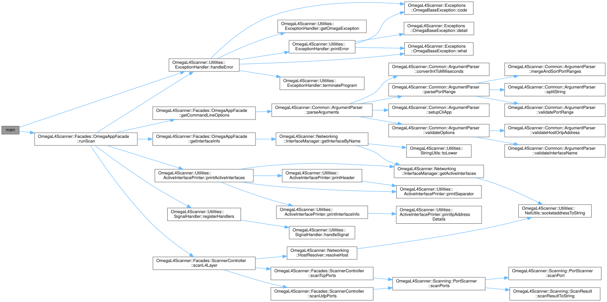

<span style="display: block; text-align: center;">*Obrázek 1: Architektura projektu OMEGA L4 Scanner*</span>

### 4.1 Modul `Common`

Hlavními součástmi modulu `Common` jsou definice vlastních datových typů a logika pro 
zpracování uživatelských vstupů, resp. vstupních argumentů příkazové řádky.

#### 4.1.1 Vlastní datové typy

Nejpodstatnějším z vlastních datových typů je datový typ `PortRange`, který je implementován jako 
`std::variant<uint16_t, std::pair<uint16_t,uint16_t>>`, což umožňuje 
flexibilní a paměťově efektivní zpracování vstupu ve formě jednotlivých portů i rozsahů portů. 
Tato implementace efektivně řeší situace, kdy uživatel zadává seznamy portů jako kombinaci 
jednotlivých hodnot i rozsahů (např. `-u 22,80-90`).

Dále jsou obsaženy dva datové typy `IPAddressVersion` a `ProtocolType`, které jsou aliasy již
existujících datových typů `std::string` a `bool`. Hodnoty, kterých mohu tyto datové typy nabývat
jsou definovány v adresáři `Constants`. Díky využití aliasů již existujících typů k reprezentaci
napříč aplikací často používaných hodnot je zajištěna konzistence a přehlednost kódu. Nemůže tedy
například dojít k tomu, že by někde byla použita hodnota `true` pro reprezentaci **IPv4** a
jinde by byla **IPv4** reprezentována hodnotou `false`, což by mohlo vést k těžce dohledatelným
chybám.

#### 4.1.2 Zpracování argumentů příkazové řádky

Parametry získané z příkazové řádky jsou uchovávány v instanci třídy `CommandLineOptions`, 
která obsahuje název síťového rozhraní, seznamy **TCP** a **UDP** portů (`std::vector<PortRange>`), 
cílovou adresu a časový limit pro čekání na odpověď. Výchozí hodnota _timeoutu_ je nastavena na 5000 ms 
dle zadání. 

Zpracování a validace vstupních argumentů probíhá prostřednictvím třídy `ArgumentParser`, 
která využívá knihovnu **CLI11** [[6]](https://cliutils.github.io/CLI11/book/) pro parsování příkazové řádky. 
Tuto knihovnu jsem zvolil pro její jednoduchost a přehledný manuál, díky kterému je možné rychle se s 
knihovnou naučit pracovat. Současně je vedena pod **BSD licencí**, která je kompatibilní s **GNU GPLv3 licencí** 
mé aplikace. 

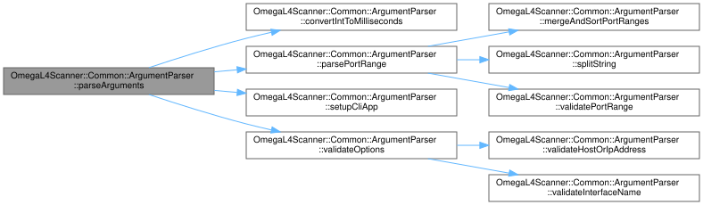

<span style="display: block; text-align: center;">*Obrázek 2: Průběh parsování argumentů příkazové řádky*</span>

`ArgumentParser` nejdříve pomocí knihovny **CLI11** validuje, že byly zadány požadované argumenty specifikované
v zadání projektu. Současně umožňuje uživateli zadat tyto argumenty v libovolném pořadí, vypsat nápovědu a provádí jednoduchou 
validaci hodnoty volitelného argumentu `--wait`, která musí být kladným celým číslem nebo nulou. Zbývající předané hodnoty
validuji v rámci vlastních metod.

Pravděpodobně nejzajímavější částí celého modulu `Common` je způsob zpracování předaných portů. Moje implementace
zahrnuje logiku, která uživateli umožňuje zadat současně jednotlivé porty i rozsahy portů. Je tedy například možné
spustit aplikaci následujícím způsobem:

```bash
./ipk-l4-scan -i eth0 -t 22,80-90,443 -u 53 localhost
```

Dále v rámci parsování zadaných portů dochází ke:

- kontrolám, zda porty leží v povoleném rozsahu $\left<1,\ 65535\right>$,
- odstranění duplicitních portů (např. `22,22,22` $\rightarrow$ `22`),
- sloučení jednotlivých portů do rozsahů, pokud je to možné (např. `80,81,82,83,443` $\rightarrow$ `80-83,443`),
- odstranění jednotlivých portů, které jsou součástí rozsahu (např. `80-85,84,443` $\rightarrow$ `80-85,443`),
- převodu rozsahů reprezentující jednotlivé port na samostatný port (např. `80-80` $\rightarrow$ `80`),
- seřazení portů a intervalů vzestupně (např. `80-85,443,22` $\rightarrow$ `22,80-85,443`).

Program tedy zvládá například zpracovat i následující vstupní argumenty:

```bash
./ipk-l4-scan -i eth0 -t 80,90-95,85,80-80,100,99-101,53,55-57,56,60-60 localhost
```

kdy interně dojde k převodu předaných portů do následujcí formy: `-t 53,55-57,60,80,85,90-95,99-101`

ArgumentParser dále využívá regulární výrazy k ověření formátu předaných **IPv4** [[7]](https://ihateregex.io/expr/ip/)
a **IPv6** [[8]](https://ihateregex.io/expr/ipv6/) adres a _hostname_. Hodnota argumentu _-i_ je v aplikaci reprezentována
tzv. _case-insensitively_, což znamená, že uživatel může zadat jak `eth0`, tak `ETH0` a aplikace tyto hodnoty 
zpracuje stejně.

### 4.2 Modul `Constants`

Adresář `Constants` obsahuje sadu hlavičkových souborů zvyšující přehlednost a usnadňujících jednotnou správu
hodnot napříč celým zdrojovým kódem. Mezi tyto konstanty patří například definice barev v podobě _**ANSI** escape
sekvencí_ (např. `COLOR_RED`, `COLOR_GREEN`apod.) v souboru `ColorEscapeSequences.hpp`. Barevné sekvence využívám ke
zvýraznění klíčových informací při výpisu aktivních rozhraní nebo chybových hlášek. Dále sem patří
texty výjimek umístěné v `ExceptionMessages.hpp`, definice protokolů (`TCP = "tcp"`, `UDP = "udp"`)
a **IP** verzí (`IPv4 = true`, `IPv6 = false`).

Mohlo by se zdát, že rozdělení konstant do jednotlivých souborů je zbytečně, ale dle mého názoru to
významně zlepšuje udržovatelnost a rozšiřitelnost programu. Tímto způsobem se například zabraňuje
nekonzistentní práci s verzemi **IP** nebo výskytu odlišných chybových zpráv, které by jinak mohly
vzniknout při manuálním opakování hodnot v různých částech kódu. Maximálně jsem se pokusil o psaní tzv. _clean kódu_,
což je sada pravidel a doporučení pro psaní čitelného a udržovatelného kódu 
[[9]](https://github.com/nesfit/ICS/blob/master/Lectures/Lecture_05/SOLIDni_kod.pdf).

### 4.3 Modul `Enums`

Modul Enums obsahuje přehledně definované třídy výčtových typů, které aplikace používá pro jasné 
označení různých stavů a chybových kódů. V současnosti modul zahrnuje dva hlavní výčty:

- Výčet `ExitCodes` obsahuje jak kódy pro úspěšné ukončení, tak kódy pro různé typy chyb využívané ve výjimkách,
které se mohou během běhu programu vyhozeny. Patří sem například chyby způsobené neplatnými argumenty, 
problémy s rozhraním, neschopností rozpoznat **IP** adresu, interní chyby aplikace, socketové chyby, ...
- Výčet `PortStatus` obsahuje výčet možných stavů síťových portů, se kterými skener pracuje. 
Rozlišuje dle zadání tří základní stavy: otevřený port (`OPEN`), uzavřený port (`CLOSED`) a filtrovaný (nedostupný) 
port (`FILTERED`).

Při výběru chybových kódů jsem se snažil do jisté míry minimalizovat jejich množtví a 
přitom se pokusit dodržet co možná nejvíce _UNIXové_ standardy [[10]](https://man7.org/linux/man-pages/man3/sysexits.h.3head.html). 
Například pro chybu `InvalidArgumentException` jsem zvolil kód `64` (resp. `EX_USAGE`), což je standardní 
kód pro chybu v argumentech příkazové řádky. Pro reprezentaci ukončení běhum aplikace uživatelem pomocí
**CTRL+C** jsem zvolil kód `130` (resp. `128 + SIGINT`), jak je doporučované v příspěvku na E-Learning fóru
k projektu [[11]](https://tldp.org/LDP/abs/html/exitcodes.html).

### 4.4 Modul `Exceptions`

Modul **Exceptions** poskytuje robustní mechanismus pro správu chybových stavů prostřednictvím výjimek. 
Základním stavebním kamenem tohoto modulu je třída **OmegaBaseException**, která dědí od standardní 
třídy `std::exception`. Tato základní třída uchovává tři klíčové informace – chybový kód (reprezentovaný 
pomocí hodnoty výčtové třídy `ExitCodes`), obecnou chybovou hlášku a volitelně dodatečný detail popisující vzniklou chybu.

Na základě **OmegaBaseException** byly díky dědičnosti vytvořeny specializované třídy výjimek. Mezi ně patří 
například **HelpRequestedException** a **InterfacePrintRequestedException**,
které se vyvolají v případech, kdy uživatel požaduje nápovědu či výpis dostupných síťových rozhraní. 
Dále modul obsahuje chybové výjimky jako **InvalidArgumentException** nebo **LibnetErrorException**

Chybové výjimky jsou zachytávány uvnitř fasády `OmegaAppFacade`, což umožňuje centralizované řízení běhu
aplikace a konzistentní správu chybových situací. Následně jsou chybové stavy zpracovávány v modulu `Utilities`, 
konkrétně v submodulu `ExceptionHandler`, který zajišťuje vypsání chybových hlášení a ukončení 
programu s odpovídajícím chybovým kódem.

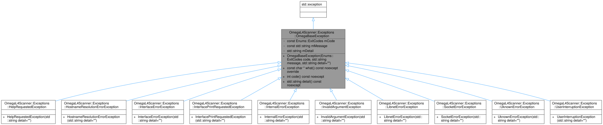

<span style="display: block; text-align: center;">*Obrázek 3: Dědičnost výjimek OMEGA Exceptions*</span>

### 4.5 Modul `Facades`

Modul `Facades` implementuje návrhový vzor *facade* [[12]](https://en.wikipedia.org/wiki/Facade_pattern), 
který poskytuje zjednodušené rozhraní k řízení 
komplexního subsystému aplikace. Tento modul centralizuje spuštění skenovacího procesu,
zpracování vstupních parametrů, registraci _signal handleru_ a integraci s ostatními moduly. Fasády podporují 
mudularitu aplikace.

#### 4.5.1 Fasáda `OmegaAppFacade`

`OmegaAppFacade` je hlavní fasádou aplikace. Je instanciována ve funkci `main()` a následně je pomocí jediného 
příkazu `appFacade.runScan(argc, argv);` zahájen samotný běh aplikace. Jejím úkolem je:

- **zpracování příkazových argumentů** pomocí třídy `ArgumentParser`,
- **získání informací o síťovém rozhraní** a popř. výpis aktivních síťových rozhraní, pokud si to uživatel přeje,
- **registrace** _signal handleru_ pro zpracování signálů,
- instanciace fasády `ScannerController` a **spuštění skenovacího procesu**,
- zachycení výjimek a jejich zpracování pomocí instance třídy `ExceptionHandler`.

#### 4.5.2 Fasáda `ScannerController`

Fasáda **ScannerController** je zodpovědná za orchestraci celého skenovacího procesu. Zajišťuje hladký průběh 
skenování a koordinuje komunikaci mezi získanými daty (např. **IP** adresami a informacemi o síťovém rozhraní) a 
samotnými skenery. Hlavní úlohy této fasády zahrnují:

- **rezoluci cílových IP adres** pomocí třídy `HostResolver`, která získá **IP** adresy cílového hostitele 
na základě zadaného vstupu,
- **TCP skenování**, pokud jsou specifikovány **TCP** porty, 
- **UDP skenování**, pokud jsou specifikovány **UDP** porty.

### 4.6 Modul `Networking`

Modul `Networking` slouží ke sběru, správě a zpracování informací o síťových 
rozhraních a **IP** adresách. Tento modul se skládá z 
datových tříd a několika submodulů, z nichž každý hraje specifickou roli při získávání detailních informací 
o síťovém prostředí.

#### 4.6.1 Datová třída `AddressInfo`

Datová třída `AddressInfo` poskytuje podrobné informace o **IP** adresách, které jsou přiřazeny k danému síťovému 
rozhraní. Tato třída uchovává údaje jako samotnou **IP** adresu, masku podsítě (_netmask_), _broadcast adresu_ (u **IPv4**) 
a také adresu pro _point-to-point_ spojení (_destination address_) (u **IPv4**), pokud je relevantní. 
V případech, kdy některá informace není k dispozici nebo není aplikovatelná (u **IPv6**), je použita 
hodnota `"N/A"`. Tato struktura slouží jako základ pro uchovávání všech nezbytných informací 
týkajících se konfigurace **IP** adres, což je nezbytné pro další síťové operace.

#### 4.6.2 Datová třída `InterfaceInfo`

Datová třída `InterfaceInfo` představuje kompletní popis síťového rozhraní. Kromě názvu rozhraní (např. `"eth0"`)
obsahuje také vektor objektů typu `AddressInfo`, jež shromažďují všechny **IP** adresy přiřazené tomuto rozhraní. 
Dále je zde uchován parametr označující systémové příznaky rozhraní.

#### 4.6.3 Submodul `HostResolver`

Třída `HostResolver` je zodpovědná za převod zadaného hostitelského jména (_hostname_) nebo **IP** adresy na seznam 
reálných **IP** adres. Pomocí funkce `getaddrinfo()` [[13]](https://man7.org/linux/man-pages/man3/getaddrinfo.3.html) 
získává tato třída jak **IPv4**, tak i **IPv6** adresy, které následně převádí na lidem čitelné řetězce. Získané 
adresy jsou následně setříděny a duplicitní hodnoty odstraněny, což zajišťuje, že výsledný seznam obsahuje 
pouze unikátní **IP** adresy. Pokud dojde při volání `getaddrinfo()` [[13]](https://man7.org/linux/man-pages/man3/getaddrinfo.3.html) 
k chybě, je vyvolána příslušná výjimka, která upozorní na problém s rezolucí hostitelského jména, což vede 
na ukončení programu s chybovým návratovým kódem `68`.

#### 4.6.4 Submodul `InterfaceManager`

Třída `InterfaceManager` poskytuje funkce pro získávání a správu informací o síťových rozhraních. Pomocí systémové 
funkce `getifaddrs()` [[14]](https://man7.org/linux/man-pages/man3/getifaddrs.3.html) získává informace o všech 
dostupných rozhraních, přičemž filtruje pouze ta, 
která jsou aktivní (resp. mají nastaven příznak `IFF_UP`). Pro každé aktivní rozhraní jsou sestaveny objekty 
typu `InterfaceInfo`, do kterých jsou následně přidány detaily získané z příslušných systémových struktur, 
včetně IP adres, masky podsítě a dalších relevantních informací. Kromě toho metoda 
`getInterfaceByName()` umožňuje vyhledat konkrétní rozhraní podle jeho názvu (podstatné pro následné skenování), a 
pokud zadané rozhraní neexistuje, je vyvolána výjimka. Tímto způsobem `InterfaceManager` zajišťuje, že aplikace 
pracuje pouze s aktuálními a správně nakonfigurovanými síťovými rozhraními.

### 4.7 Modul `Scanning`

Modul `Scanning` je nejdůležitějším modulem celého projektu. Definuje abstraktní (virtuální) třídu
`PortScanner`, která obsahuje společné funkce jako `scanPorts()`, `createRawSocket()`, `initLibnetContext()` 
atd. Z fasády `ScannerController` se volají funkce `scanTcpPorts()` a `scanUdpPorts()`, které
provádějí skenování požadovaných portů. Výstupem skenování každého portu je instance 
třídy `ScanResult`, která obsahuje cílovou **IP** adresu, port, protokol a stav portu. Na základě těchto
informací je pak generován výstupní text, který je následně vytištěn do terminálu. Tím je zaručeno,
že výstupní formát je jednotný a přehledný:

```terminaloutput
192.168.1.2 80 tcp open
192.168.1.2 42 udp closed
```

#### 4.7.1 Abstraktní (virtuální) třída `PortScanner`

Submodul `PortScanner` je zodpovědný za skenování síťových portů. Tento submodul poskytuje abstraktní 
základ pro implementaci konkrétních skenerů `UDPScanner` a `TCPScanner`, které definují specifickou 
logiku skenování pro jednotlivé protokoly. Třída `PortScanner` slouží jako obecné rozhraní pro přípravu, 
odesílání a vyhodnocování síťových paketů při skenování portů. Obsahuje jako čistě virtuální metody, tak
i sdílené implementované metody děděné odvozenými třídami.

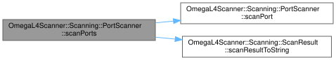

<span style="display: block; text-align: center;">*Obrázek 4: Základ architektury třídy `PortScanner`*</span>

Veřejná metoda `scanPorts()` rozbalí zadané portové rozsahy na jednotlivé porty a pro každý port a 
každou cílovou **IP** adresu zavolá metodu `scanPort()`. Jelikož je metoda `scanPort()` deklarována jako 
čistě virtuální, musí být implementována v děděných třídách, které se specializují na konkrétní
protokol (**UDP** nebo **TCP**).

Kromě toho třída `PortScanner` definuje několik chráněných pomocných metod – 
například metodu pro převod doby čekání z milisekund (`std::chrono::milliseconds`) na celé číslo (`long int`) 
s ošetřením případného přetečení (do terminálu se vytiskne varování a program pokračuje dál s maximálním
možným _--wait_), metody pro získání zdrojové **IP** adresy ze síťového rozhraní, rozlišení verze **IP** 
adresy (**IPv4**/**IPv6**) na základě přítomnosti znaku dvojtečky, nastavení socketu do neblokujícího režimu, 
inicializaci kontextu knihovny _libnet_ [[5]](https://www.cs.dartmouth.edu/~sergey/cs60/libnet1-doc/index.html) 
pro injekci paketů a konstrukci **IP** hlaviček jak pro protokol IPv4 pomocí funkce `libnet_build_ipv4()`
[[15]](https://www.cs.dartmouth.edu/~sergey/cs60/libnet1-doc/libnet-functions_8h.html#a2d9839736df3b1c46acdcc67e291c03e), tak i pro protokol IPv6 pomocí funkce `libnet_build_ipv6()` [[16]](ttps://www.cs.dartmouth.edu/~sergey/cs60/libnet1-doc/libnet-functions_8h.html#a50fc0e6ad5c2b1fd705f349eff382dfd). 

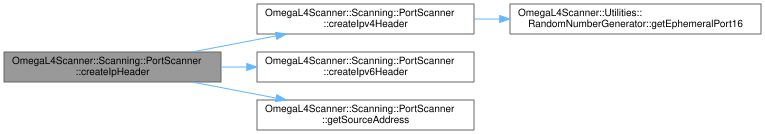

<span style="display: block; text-align: center;">*Obrázek 5: Architektura metody `createIpHeader()`*</span>

Dále jsou zde obsaženy metody jako `useNonBlockingMode()`, která nastavuje _raw socket_ do neblokujícího režimu, a metoda
`checkRawResponse()`, která pomocí funkce `select()` [[17]](https://moodle.vut.cz/pluginfile.php/1081875/mod_folder/content/0/IPK2024-25L-04-PROGRAMOVANI.pdf) 
čeká na odpověď na _raw socketu_ a předává přijatá data
virtuální metodě `determinePortStatus`, jež vyhodnotí stav portu (_open_, _closed_ nebo _filtered_).

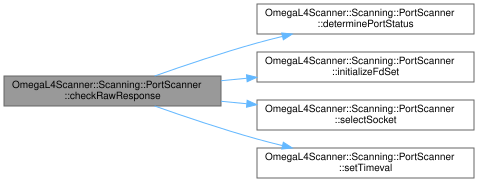

<span style="display: block; text-align: center;">*Obrázek 6: Architektura metody `checkRawResponse()`*</span>

#### 4.7.2 Submodul `TCPScanner`

Submodul `TCPScanner` je určen ke skenování **TCP** portů na zadaných **IP** adresách. Jak bylo zmíněno dříve, 
využívá _raw sockety_ a knihovnu _libnet_ [[5]](https://www.cs.dartmouth.edu/~sergey/cs60/libnet1-doc/index.html)
k odesílání **TCP SYN paketů** a následnému vyhodnocení 
odpovědí, což umožňuje určit, zda je port otevřený, uzavřený nebo filtrován. TCPScanner dědí od abstraktní 
třídy `PortScanner`. TCPScanner rozšiřuje její funkcionalitu o specifickou logiku pro **TCP** protokol 
v podobě konkrétní implementace čistě virtuálních metod.

V rámci submodulu `TCPScanner` dochází nejdříve k vytvoření _libnet kontextu_ a _raw socketu_ v neblokujícím 
režimu následovaném sestavením **TCP** a **IP** hlavičky – knihovna _libnet_ sice poskytuje zjednodušené
rozhraní pro tvorbu TCP hlavičky, přesto jsem si ale prostudoval blíže také _RFC 9293_ 
[[18]](https://datatracker.ietf.org/doc/html/rfc9293#name-header-format), jelikož chápaní struktury TCP hlavičky 
bylo stěžejní pro korektní validaci přijaté TCP odpovědi. Následuje vytvoření a odeslání **TCP SYN paketu**  
Paket je odeslán pomocí knihovny _libnet_, resp. funkce `libnet_write()`. Po odeslání paketu se _raw socket_ 
přepne do neblokujícího režimu a `TCPScanner` čeká na odpověď. Odpověď může přijít jako `SYN/ACK`, což 
signalizuje otevřený port, nebo `RST`, což signalizuje uzavřený port. Pokud program neobdrží odpověď do
vypršení doby _--wait_ je **TCP SYN paket** odeslán podruhé. Druhé odeslání je provedeno ze stejného portu jako
první odeslání – díky tomu je možné v rámci druhého odeslání zachytit opožděnou odpověď z prvního pokusu,
což zvyšuje šanci na správné vyhodnocení stavu portu. Pokud ani po druhém pokusu neobdrží program odpověď, 
je port označen jako filtrovaný.

Vyhodnocení odpovědi probíhá v metodě `determinePortStatus()`, která analyzuje přijatý paket. 
U **IPv4** se nejdříve vyhodnocuje délka **IPv4** hlavičky a až následně se z **TCP** hlavičky kontrolují 
příznaky. Podobný postup probíhá i u **IPv6**, přičemž je zohledněno, že jádro systému může v některých
případech do _raw socketu_ zapsat pouze **TCP** hlavičku odpovědi a **IPv6** hlavičku vynechat (přestože v programu 
_WireShark_, který pracuje mírně odlišně od knihovny _libnet_, se zobrazuje délka včetně **IPv6** hlavičky). 
U **IPv6** je tedy za korektně přijatou odpověď považována i taková zpráva, která svojí délkou odpovídá 
přesně délce **TCP** hlavičky.

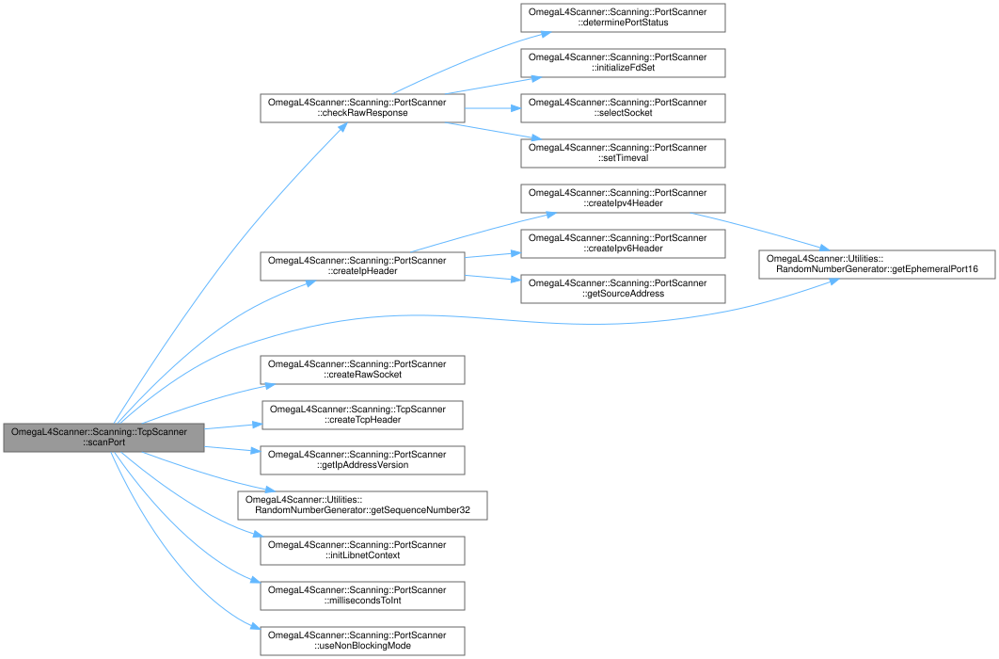

<span style="display: block; text-align: center;">*Obrázek 7: Architektura třídy `TCPScanner`*</span>

#### 4.7.3 Submodul `UDPScanner`

Submodul `UDPScanner` je určen ke skenování **UDP** portů na zadaných **IP** adresách. Tento submodul rovněž
využívá knihovnu _libnet_ pro sestavování a odesílání **UDP paketů**, přičemž následně analyzuje příchozí
odpovědi, aby určil, zda je port otevřený či uzavřený. Třída `UDPScanner` dědí od abstraktní třídy
`PortScanner` a implementuje její čistě virtuální metody specifickou logikou potřebnou pro **UDP** protokol.

Po vytvoření instanciaci třídy `UDPScanner` je nejprve inicializován _libnet kontext_, který slouží k 
sestavení paketů. Následně je vytvořen _raw socket_ pro příjem ICMP zpráv. Program pak generuje náhodný 
zdrojový port a sestavuje **UDP** hlavičku pomocí funkce `libnet_build_udp()`, která zajistí správné 
nastavení parametrů jako zdrojový a cílový port, délku a checksum (automaticky vypočítaný). Poté následuje 
sestavení a odeslání **IP** hlavičky odpovídající zvolené IP verzi (**IPv4** nebo **IPv6**).

Po odeslání **UDP** paketu program čeká v neblokujícím režimu na **ICMP** odpověď 
[[3]](https://www.iana.org/assignments/icmp-parameters/icmp-parameters.xhtml), která indikuje stav 
cílového **UDP** portu. Obdrží-li program **ICMP** zprávu _typu 3, kódu 3_ (**IPv4**), nebo _typu 1, kódu 4_ 
(**IPv6**), vyhodnotí cílový port jako uzavřený. Pokud žádnou takovou odpověď v definovaném časovém limitu 
nedostane, port je považován za otevřený.

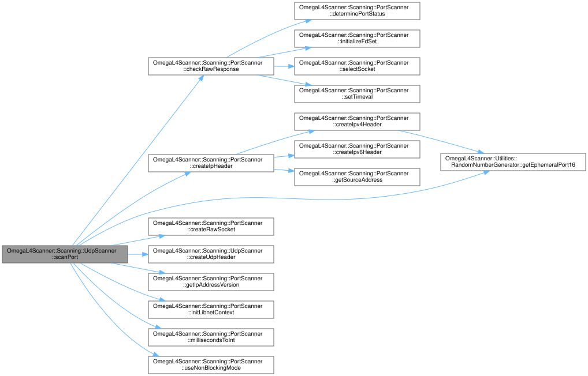

<span style="display: block; text-align: center;">*Obrázek 8: Architektura třídy `UDPScanner`*</span>

### 4.8 Modul `Utilities`

#### 4.8.1 Submodul `ActiveInterfacePrinter`

Submodul `ActiveInterfacePrinter` slouží k tisku informací o aktivních síťových rozhraních systému. 
Využívá metody pro výpis názvu rozhraní, jeho příznaků a **IP** adres (včetně detailů jako masky sítě, 
broadcast a cílové adresy). Výstup je přehledně barevně formátován a vizuálně oddělen různými separátory, 
což usnadňuje orientaci při čtení.

```bash
./ipk-l4-scan {-i | --interface}
```

<pre>
<span>================================================================================</span>
<span>|                          Active Network Interfaces                           |</span>
<span>================================================================================</span>
<span style="font-weight: bold;">Interface: eth0</span>
<span style="color: #ff0000;">  Flags: </span>69699
<span style="color: #00cccc;">  IP Addresses:</span>
    1) 172.23.254.28
       - <span style="color: #ffcc00;">Netmask: </span>255.255.240.0
       - <span style="color: #ff00ff;">Broadcast Address: </span>172.23.255.255
       - <span style="color: #00ff00;">Destination Address: </span>N/A
    2) fe80::215:5dff:fe4d:830f
       - <span style="color: #ffcc00;">Netmask: </span>N/A
       - <span style="color: #ff00ff;">Broadcast Address: </span>N/A
       - <span style="color: #00ff00;">Destination Address: </span>N/A
<span>--------------------------------------------------------------------------------</span>
<span style="font-weight: bold;">Interface: lo</span>
<span style="color: #ff0000;">  Flags: </span>65609
<span style="color: #00cccc;">  IP Addresses:</span>
    1) 127.0.0.1
       - <span style="color: #ffcc00;">Netmask: </span>255.0.0.0
       - <span style="color: #ff00ff;">Broadcast Address: </span>N/A
       - <span style="color: #00ff00;">Destination Address: </span>N/A
    2) 10.255.255.254
       - <span style="color: #ffcc00;">Netmask: </span>255.255.255.255
       - <span style="color: #ff00ff;">Broadcast Address: </span>N/A
       - <span style="color: #00ff00;">Destination Address: </span>N/A
    3) ::1
       - <span style="color: #ffcc00;">Netmask: </span>N/A
       - <span style="color: #ff00ff;">Broadcast Address: </span>N/A
       - <span style="color: #00ff00;">Destination Address: </span>N/A
<span>================================================================================</span>
</pre>

#### 4.8.2 Submodul `RandomNumberGenerator`

Submodul `RandomNumberGenerator` poskytuje metody generující náhodná čísla určená pro síťové operace. 
Mezi nejdůležitější funkce patří generování 16-bitových _efemérních portů_ [[19]](https://en.wikipedia.org/wiki/Ephemeral_port) 
v rozsahu $\left<49152,\ 65535\right>$ (rozsah doporučený v _RFC 6335_ [[20]](https://datatracker.ietf.org/doc/html/rfc6335))
a generování 32-bitových sekvenčních čísel [[21]](https://www.geeksforgeeks.org/how-tcp-sequence-number-works/). 
Používá generátor _Mersenne Twister_ [[22]](https://en.wikipedia.org/wiki/Mersenne_Twister) pro dosažení kvalitního 
a rovnoměrného rozložení hodnot. Tento generátor jsem si vybral jelikož je standardní součástí **C++** od **C++11**
a produkoval mi dostatečně náhodná čísla pro účely skenování portů.

#### 4.8.3 Submodul `ExceptionHandler`

Submodul `ExceptionHandler` zodpovídá za zachytávání, formátování a tisk výjimek (chybových stavů). 
Obsahuje metody pro detekci a rozlišení typu výjimky, tisknutí detailních zpráv o chybách včetně 
chybových kódů a zajištění řízeného ukončení programu.

#### 4.8.4 Submodul `NetUtils`

Submodul `NetUtils` obsahuje pomocné metody pro síťové operace, například převod adresy typu `sockaddr` 
[[23]](https://man7.org/linux/man-pages/man3/sockaddr.3type.html) na čitelný řetězec.

#### 4.8.5 Submodul `StringUtils`

Submodul `StringUtils` je jednouchý pomocný submodul, který poskytuje metodu na převod
řetězce typu `std::string` na malá písmena. Tato metoda je implementována dle příspěvku
na _StackOverflow_ [[24]](https://stackoverflow.com/a/313990). Tato funkce je využívána
při zpracování předaného rozhraní _-i_ – dosažení tzv. case-insensitive porovnávání při
kontrole dostupnosti předaného rozhraní.

#### 4.8.6 Submodul `SignalHandler`

Submodul `SignalHandler` řeší zachytávání a zpracování systémových signálů, resp. signálu `SIGINT`, kterým 
může uživatel v libovolný okamžik ukončit běh aplikace pomocí klávesové zkratky **CTRL+C**. Po zachycení 
signálu generuje příslušnou výjimku.

### 4.9 Modul `App`

Nakonec je zde modul `App`, který obsahuje vstupní bod aplikace v podobě souboru `main.cpp`. Jeho 
implementace je minimalistická – vytváří instanci třídy `OmegaAppFacade`, spouští metodu 
`runScan(argc, argv)` a celý tento proces je zabalený do bloku `try-catch` (všechny vyjímky by 
měly být zachyceny v rámci fasády, přesto je _good-practice_ mít tento blok i ve fukci `main()`). 

---

## 5. Testování a verifikace funkčnosti

Pro ověření, že OMEGA L4 Scanner správně implementuje požadované síťové chování, je vhodné provádět
jak **integrační**, tak **jednotkové** testy.

### 5.1 Testování funkčnosti skenování

Tato sekce dokumentuje výsledky testování aplikace z hlediska její schopnosti skenování TCP a UDP portů. 
Testování ověřovalo základní funkčnost i okrajové případy s cílem zajistit robustnost a determinismus 
výsledků. Výsledky testů byly porovnány s osvědčeným nástrojem `nmap`.

#### 5.1.1 Testovací prostředí

- **Operační systém**: Ubuntu 24.04.2 LTS, `amd64` ([IPK25_Ubuntu24.ova](https://nextcloud.fit.vutbr.cz/s/N5fM3Njwm6yfbeZ/download?path=%2F&files=IPK25_Ubuntu24.ova))
- **Vývojové prostředí**: `nix develop "git+https://git.fit.vutbr.cz/NESFIT/dev-envs.git?dir=ipk#c"`
- **Standard C++**: C++20
- **Překladač**: GCC 13.3.0
- **GNU Make**: verze 4.4.1
- **Knihovna `CLI11`**: verze 2.5.0
- **Knihovna `libnet`**: verze 1.3


#### 5.1.2 Testovací scénáře

##### 5.1.2.1 Localhost TCP skenování na rozhraní `enp0s3`

- **Co bylo testováno:** Detekce otevřených a zavřených TCP portů na adrese `localhost`.
- **Důvod:** Ověření funkčnosti skeneru při komunikaci se službami běžícími na stejném zařízení.<br><br>

- **Příkaz pro spuštění skeneru:**
  ```bash
  ./ipk-l4-scan -i enp0s3 -t 22,81 localhost
  ```

- **Očekávaný výstup:**
  ```terminaloutput
  127.0.0.1 22 tcp open
  127.0.0.1 81 tcp closed
  ```

- **Skutečný výstup:**
  ```terminaloutput
  127.0.0.1 22 tcp filtered
  127.0.0.1 81 tcp filtered
  ```

- **Zhodnocení:**
  - Očekávaným výstupem bylo, že port 22 je otevřený a port 81 je zavřený, jelikož na portu 22 je 
    spuštěn SSH server a na portu 81 nebývá spuštěna žádná služba. Skener však oba porty označil 
    jako `filtered`.
    - V Linuxu _raw sockety_ nezachytí provoz směřující na _loopbackové_ adresy (např. `127.0.0.1` 
      nebo `localhost`), pokud nejsou navázané přímo na _loopback_ rozhraní (`lo`).
    - I když jsou takové pakety viditelné pomocí nástrojů jako `tcpdump` (využívajících `libpcap` a 
      zachytávajících pakety na linkové vrstvě), jádro je obvykle nedoručí raw socketům navázaným na 
      jiné rozhraní (např. `enp0s3`).
    - Důvodem je zpracování loopbackového provozu přímo uvnitř kernelu – tento provoz neprochází běžným 
      směrováním a není směrován přes fyzická rozhraní.
    - Pro spolehlivé skenování `localhostu` je proto nutné raw socket navázat přímo na rozhraní `lo`, 
      případně použít nástroj jako `libpcap`, který umožňuje zachytávání paketů nezávisle na IP stacku.

##### 5.1.2.2 Localhost UDP skenování na rozhraní `enp0s3`

- **Co bylo testováno:** Schopnost skeneru správně detekovat zavřené UDP porty pomocí přijaté ICMP odpovědi.
- **Proč:** UDP porty nevracejí odpověď samy o sobě – pro detekci zavřeného portu se očekává ICMP zpráva 
            typu 3, kód 3 (_port unreachable_), kterou vrací cílový systém. <br><br>

- **Příkaz pro spuštění skeneru:**
  ```bash
  ./ipk-l4-scan -i enp0s3 -u 53,123 localhost
  ```

- **Očekávaný výstup:**
  ```terminaloutput
  127.0.0.1 53 udp closed
  127.0.0.1 123 udp closed
  ```
  - Oba porty označeny jako `closed` na základě přijaté ICMP odpovědi typu 3, kódu 3.

- **Skutečný výstup:**
  ```terminaloutput
  127.0.0.1 53 udp closed
  127.0.0.1 123 udp closed
  ```
  
- **Zhodnocení:**
  - Skener správně detekoval zavřené UDP porty pomocí ICMP odpovědi a oba porty označil jako `closed` 
    na přijaté základě ICMP odpovědi _typu 3, kódu 3_ (_port unreachable_).
  - Tato metoda je spolehlivá na systémech, kde jádro odpovídá na nepodporované UDP dotazy ICMP chybou (např. `localhost`).
  - Chování odpovídá očekávanému průběhu UDP skenování podle běžných síťových standardů.

##### 5.1.2.3 Localhost TCP/UDP skenování na rozhraní `lo` (_loopback_)

- **Co bylo testováno:** Detekce různých stavů portů (`open`, `closed`, `filtered`) při skenování `localhostu` přes loopbackové rozhraní.
- **Proč:** Ověření chování skeneru při skenování lokálních služeb a správná interpretace odpovědí TCP a UDP socketů.<br><br>

- **Příprava prostředí ve druhé terminálovém okně:**
  1. **Zablokování TCP portu 23458 pomocí firewallu (simulace `filtered`)**:
     ```bash
     sudo iptables -A INPUT -p tcp --dport 23458 -j DROP
     ```
  2. **Spuštění serverů na zvolených portech:**
     ```python
     python3 -u - <<'EOF'
     import socket
     import threading
     import time

     def udp_server():
         sock = socket.socket(socket.AF_INET, socket.SOCK_DGRAM)
         sock.bind(('0.0.0.0', 12345))
         print('[UDP] Port 12345 opened (UDP OPEN). Waiting for data...')
         try:
             sock.settimeout(60)
             sock.recvfrom(1024)
             print('[UDP] Data received, closing UDP socket.')
         except socket.timeout:
             print('[UDP] Timeout expired, closing UDP socket.')
         sock.close()
     
     def tcp_server():
         sock = socket.socket(socket.AF_INET, socket.SOCK_STREAM)
         sock.bind(('0.0.0.0', 23456))
         sock.listen(1)
         print('[TCP] Port 23456 opened (TCP OPEN). Waiting for connection...')
         sock.settimeout(60)
         try:
             conn, addr = sock.accept()
             print(f'[TCP] Connection from {addr}, closing TCP socket.')
             conn.close()
         except socket.timeout:
             print('[TCP] Timeout expired, closing TCP socket.')
         sock.close()
     
     threading.Thread(target=udp_server, daemon=True).start()
     threading.Thread(target=tcp_server, daemon=True).start()
     
     print('[INFO] UDP port 12345 = OPEN')
     print('[INFO] TCP port 23456 = OPEN')
     print('[INFO] UDP port 12346 = CLOSED (nothing is listening)')
     print('[INFO] TCP port 23457 = CLOSED (nothing is listening)')
     print('[INFO] TCP port 23458 = FILTERED (blocked by firewall: DROP rule)')
     
     time.sleep(60)
     print('[INFO] Script finished.')
     EOF
     
     ```
  3. **Obnovení pravidel firewallu:**
     ```bash
     sudo iptables -D INPUT -p tcp --dport 23458 -j DROP
     ```

- **Příkaz pro spuštění skeneru:**
  ```bash
  ./ipk-l4-scan -i lo -t 23456,23457,23458 -u 12345,12346 localhost
  ```
  
- **Očekávaný výstup:**
  ```terminaloutput
  127.0.0.1 23456 tcp open
  127.0.0.1 23457 tcp closed
  127.0.0.1 23458 tcp filtered
  127.0.0.1 12345 udp open
  127.0.0.1 12346 udp closed
  ```
  
- **Skutečný výstup:**
  ```terminaloutput
  127.0.0.1 23456 tcp open
  127.0.0.1 23457 tcp closed
  127.0.0.1 23458 tcp filtered
  127.0.0.1 12345 udp open
  127.0.0.1 12346 udp closed
  ```

- **Zhodnocení:**
  - Skener správně rozpoznal otevřené porty na loopbacku.
  - Na **UDP** portu `12346` byla přijata **ICMP** odpověď typu 3, kód 3 (`port unreachable`), takže port byl označen jako `closed`.
  - TCP port `23458` byl zablokován pomocí firewallu (`DROP`), což simulovalo stav `filtered` – žádná odpověď, timeout.
  - Test potvrdil schopnost skeneru přesně interpretovat odpovědi pro **TCP** i **UDP** v kontextu `localhostu`.

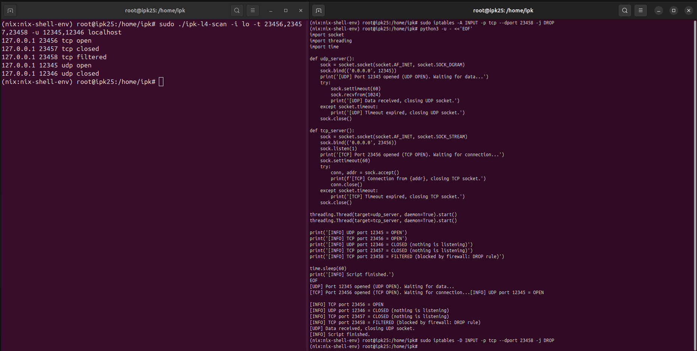

<span style="display: block; text-align: center;">*Obrázek 9: Test `localhost` **TCP**/**UDP** skenování na rozhraní `-i lo` (loopback)*</span>

##### 5.1.2.4 Skenování vzdáleného cíle

- **Co bylo testováno:** Detekce stavu TCP a UDP portů na vzdáleném serveru `www.vutbr.cz`.
- **Proč:** Ověření správnosti implementace vůči známým službám a porovnání výsledků se skenerem `nmap`. <br><br>

- **Příkaz pro spuštění skeneru:**
  ```bash
  ./ipk-l4-scan -i enp0s3 --pt 21,80-81,443,62515 -u 21,58,55358 www.vutbr.cz
  ```

- **Referenční/očekávaný výstup (`nmap`):**
  ```bash
  nmap -sS -p21,80-81,443,62515 www.vutbr.cz
  ```
  ```terminaloutput
  Nmap scan report for www.vutbr.cz (147.229.2.90)
  PORT      STATE    SERVICE
  21/tcp    filtered ftp
  80/tcp    open     http
  81/tcp    filtered hosts2-ns
  443/tcp   open     https
  62515/tcp filtered unknown
  ```
  ```bash
  nmap -sU -p21,58,55358 www.vutbr.cz
  ```
  ```terminaloutput
  Nmap scan report for www.vutbr.cz (147.229.2.90)
  PORT      STATE         SERVICE
  21/udp    open|filtered ftp
  58/udp    open|filtered xns-mail
  55358/udp open|filtered unknown
  ```

- **Skutečný výstup:**
  ```terminaloutput
  147.229.2.90 21 tcp filtered
  147.229.2.90 80 tcp open
  147.229.2.90 81 tcp filtered
  147.229.2.90 443 tcp open
  147.229.2.90 62515 tcp filtered
  147.229.2.90 21 udp open
  147.229.2.90 58 udp open
  147.229.2.90 55358 udp open
  ```

- **Zhodnocení:**
  - Skener správně identifikoval stav standardních **TCP** portů:
    - Porty **80** a **443** byly detekovány jako `OPEN`, což odpovídá běžícím webovým službám.
    - Ostatní **TCP** porty byly `CLOSED`, v souladu s očekáváním.
  - U **UDP** portů byly všechny testované porty označeny jako `OPEN`, což naznačuje, že:
    - buď skutečně existuje aktivní **UDP** služba, která reagovala,
    - nebo na daném portu nebyla vrácena žádná **ICMP** unreachable odpověď (a tím pádem nebyl označen 
      jako `CLOSED`).
  - Chování **UDP** portů může být ovlivněno konfigurací firewallu na straně cílového serveru.
  - Skener tímto prokázal schopnost správně zachytit a vyhodnotit odpovědi vzdáleného serveru jak pro 
    **TCP**, tak i pro **UDP**, včetně méně běžných portů.

##### 5.1.2.5 Skenování hostname s IPv4 i IPv6 adresami

- **Co bylo testováno:** Detekce stavů TCP a UDP portů u hostname `www.fit.vutbr.cz`, které má jak IPv4, tak i IPv6 adresu.
- **Proč:** Ověření správné podpory více adres při DNS záznamu (`A` i `AAAA`) a srovnání s referenčním chováním skeneru `nmap`. <br><br>

- **Příkaz pro spuštění skeneru:**
  ```bash
  ./ipk-l4-scan -i enp0s3 --pt 21,80-81,443,62515 -u 21,58,55358 www.fit.vutbr.cz
  ```

- **Referenční/očekávaný výstup (`nmap`):**
  ```bash
  nmap -4 -sT -p21,80,81,443,62515 www.fit.vutbr.cz
  nmap -6 -sT -p21,80,81,443,62515 www.fit.vutbr.cz
  ```
  ```terminaloutput
  Nmap scan report for www.fit.vutbr.cz (147.229.9.23)
  
  PORT      STATE    SERVICE
  21/tcp    filtered ftp
  80/tcp    open     http
  81/tcp    filtered hosts2-ns
  443/tcp   open     https
  62515/tcp filtered unknown
  
  Nmap scan report for www.fit.vutbr.cz (2001:67c:1220:809::93e5:917)
  
  PORT      STATE  SERVICE
  21/tcp    closed ftp
  80/tcp    closed http
  81/tcp    closed hosts2-ns
  443/tcp   closed https
  62515/tcp closed unknown
  ```
  ```bash
  nmap -4 -sU -p21,58,55358 www.fit.vutbr.cz
  nmap -6 -sU -p21,58,55358 www.fit.vutbr.cz
  ```
  ```terminaloutput
  Nmap scan report for www.fit.vutbr.cz (147.229.9.23)
  PORT      STATE    SERVICE
  21/udp    filtered ftp
  58/udp    filtered xns-mail
  55358/udp filtered unknown
  
  Nmap scan report for www.fit.vutbr.cz (2001:67c:1220:809::93e5:917)
  PORT      STATE    SERVICE
  21/udp    filtered ftp
  58/udp    filtered xns-mail
  55358/udp filtered unknown
  ```

- **Skutečný výstup:**
  ```terminaloutput
  147.229.9.23 21 tcp closed
  2001:67c:1220:809::93e5:917 21 tcp closed
  147.229.9.23 80 tcp open
  147.229.9.23 81 tcp closed
  2001:67c:1220:809::93e5:917 80 tcp closed
  2001:67c:1220:809::93e5:917 81 tcp closed
  147.229.9.23 443 tcp open
  2001:67c:1220:809::93e5:917 443 tcp closed
  147.229.9.23 62515 tcp closed
  2001:67c:1220:809::93e5:917 62515 tcp closed
  147.229.9.23 21 udp closed
  2001:67c:1220:809::93e5:917 21 udp open
  147.229.9.23 58 udp closed
  2001:67c:1220:809::93e5:917 58 udp open
  147.229.9.23 55358 udp closed
  2001:67c:1220:809::93e5:917 55358 udp open
  ```

- **Zhodnocení:**
  - Výsledky pro **TCP IPv4 porty** odpovídají stavu zjištěnému nástrojem `nmap`. Porty **80** a **443** byly správně detekovány jako `open`, ostatní jako `closed`, 
    přičemž `nmap` některé označil jako `filtered`, což je v rozporu s mými výsledky:
    - **Wireshark analýza** ukazuje, že při pokusy o navázání spojení s porty označenými mým skenerem jako `closed` (např. **TCP** port **21**) dorazila zpět odpověď 
      **TCP RST**, což dle zadání znamená, že port je skutečně zavřený, a tedy závěr mého skeneru správný nehledě na výsledek nástroje `nmap`. 
    - Viz [Obrázek 10](doc/resources/img/obrazek_10_wireshark_fit.vutbr.cz_tcp.png).

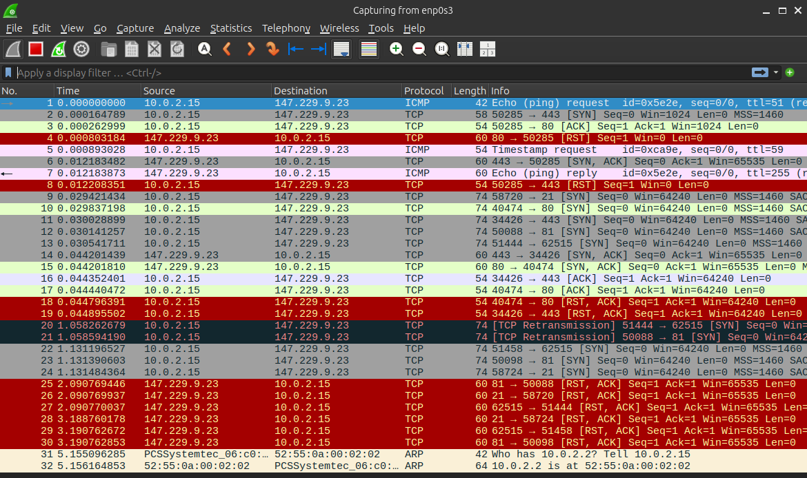

<span style="display: block; text-align: center;">*Obrázek 10: Wireshark analýza IPv4 TCP na `www.fit.vutbr.cz`*</span>

- - Pro **TCP IPv6 porty** se výstupy `nmap` i mého skeneru shodují – všechny porty označeny jako `closed`, odpovídá tomu chování cílového serveru.
  - **Rozdíly vznikly u UDP portů na IPv6 adrese**:  
    - `nmap` všechny označil jako `filtered`, zatímco můj skener označil porty **21**, **58** a **55358** jako `open`.
    - **Wireshark ukazuje**, že na tyto **UDP** pakety přišla odpověď ve formě **ICMPv6** zprávy _typu 1 (Destination Unreachable), kódu 0 (No Route to destination)_.  
      Dle zadání však jako `closed` máme označit pouze **ICMP** odpověď _typu 3, kódu 3 (Port Unreachable)_, resp. _typu 1, kódu 4_ u **ICMPv6**. 
      Všechny ostatní ICMP odpovědi (včetně _No Route to Destination_) by tedy měly být interpretovány jako `open`.  
      Můj skener tedy výsledek **interpretuje korektně podle zadání**.
    - Viz [Obrázek 11](doc/resources/img/obrazek_11_wireshark_fit.vutbr.cz_udp.png).

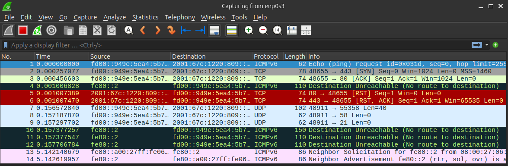

<span style="display: block; text-align: center;">*Obrázek 11: Wireshark analýza IPv6 UDP na `www.fit.vutbr.cz`*</span>


### 5.2 Jednotkové testy pomocí frameworku Google Test

Pro zajištění vysoké kvality, stability a robustnosti aplikace byly vytvořeny podrobné jednotkové 
testy s využitím testovacího frameworku **Google Test** [[25]](https://ivs.fit.vutbr.cz/IVS2024_2-testovani.pdf).
Tyto testy jsou zaměřeny na izolované moduly a třídy, což umožňuje důkladné ověření správnosti jejich 
implementace bez vzájemných závislostí a rušivých vlivů vnějších faktorů.

#### 5.2.1 Testovací prostředí

Testy byly realizovány v pečlivě specifikovaném vývojářském prostředí s cílem zajistit
reprodukovatelnost výsledků:

- **Operační systém**: Windows 11 WSL Ubuntu 24.04.2 LTS
- **Standard C++**: C++20
- **Překladač**: GCC 14.2.0
- **Google Test framework**: verze 1.16.0
  - **CMake**: verze 3.31.6
  - **Vývojové prostředí**: JetBrains CLion 2025.1 Beta
- **Knihovna `CLI11`**: verze 2.5.0
- **Knihovna `libnet`**: verze 1.3

Při spouštění testů přímo v příkazovém řádku dochází k nepředvídatelnému chování kvůli
použití staticých proměnných a statických metod. Operační systém často alokuje 
testovací data jednotlivých _test-case_ na stejné adresy v paměti, čímž dochází k
vzájemnému ovlivňování testů. Proto je doporučeno spouštět testy pomocí 
**CMake** v rámci kvalitativního vývojového prostředí, které má v sobě
**Google Test** framework přímo integrovaný - testováno v **CLion**.

#### 5.2.2 Co bylo testováno?

Byly detailně testovány následující klíčové submoduly aplikace:

- `ArgumentParser` – třída zodpovědná za parsování argumentů z příkazové řádky a jejich validaci.
- `ExceptionHandler` – modul pro zachytávání výjimek, jejich formátování a obsluhu.
- `InterfaceManager` – komponenta spravující síťová rozhraní, jejich aktivaci a načítání relevantních dat.
- `OmegaExceptions` – sada vlastních výjimek aplikace určená pro specifické chybové situace.

> Výpis výsledků unit testů si můžete prohlédnout v sekci [8.3](#83-výsledky-unit-testů).

#### 5.2.3 Proč to bylo testováno?

Každý z těchto submodulů byl testován z důvodu jeho zásadního významu pro funkčnost a stabilitu 
celé aplikace. Správné parsování argumentů je klíčové pro použití aplikace uživateli, neboť nesprávná 
interpretace může vést k chybnému chování programu. `ExceptionHandler` zajišťuje, aby aplikace vždy 
reagovala předvídatelně a poskytovala uživateli jasné informace o chybách. `InterfaceManager` je nezbytný 
pro efektivní komunikaci s operačním systémem a správu síťových rozhraní, což přímo ovlivňuje 
schopnost aplikace provádět síťové operace.

Důvodem proč exsitují unit testy pouze na těchto několik submodulů je ten, že se jedná základní stavební
kámen celé aplikace. Před vývojem samotné logiky skenování jsem si potřeboval být jistý, že to, co jsem
doposud naimplementoval, funguje správně a dle mých očekávání. Následné hledání chyb napříč celým programem
by z časového hlediska bylo mnohem více neefektivní, než psaní automatizovaných testů základní funkcionality,
kterými si budu moci ověřit funkčnosti i budoucích případných zásahů do těchto modulů.

#### 5.2.4 Jak to bylo testováno?

Všechny jednotkové testy byly implementovány pomocí frameworku **Google Test** a důsledně rozděleny do 
tří hlavních fází:

1. **Arrange (Příprava)** – příprava testovacího prostředí a vstupních dat.
2. **Act (Akce)** – provedení testované operace.
3. **Assert (Ověření)** – porovnání skutečných výsledků s očekávanými výsledky.

U submodulu `ArgumentParser` byly testovány různé kombinace platných i neplatných argumentů. 
Testovalo se jak úspěšné parsování argumentů, tak správné generování výjimek při výskytu neočekávaných 
nebo nesprávných vstupů.

V případě `ExceptionHandler` byly simulovány různé typy výjimek (např. `HelpRequestedException`, 
`InterfacePrintRequestedException`, `InvalidArgumentException` aj.) a ověřovalo se, zda 
submodul `ExceptionHandler` správně reaguje odpovídajícím výstupním kódem aplikace a zprávou.

Pro testování `InterfaceManageru` bylo využito _mockování_ systémových volání (`getifaddrs()`, `freeifaddrs()`). 
Pomocí simulovaných rozhraní jsem ověřoval, zda správně dochází k načtení aktivních síťových rozhraní, 
a zda jsou správně ignorována neaktivní či nesprávně nakonfigurovaná rozhraní.

U submodulu `OmegaExceptions` byly testovány specifické vlastní výjimky, zda korektně obsahují 
správné kódy chyb, příslušné zprávy a detaily, což umožňuje jasnou diagnostiku problémů během 
běhu aplikace.

---

## 6. Závěr

Projekt **OMEGA L4 Scanner** úspěšně demonstruje praktické využití síťového programování na nízké úrovni pomocí **C++** a 
knihovny **libnet**. Při jeho návrhu a implementaci byl kladen důraz na **modularitu**, **čitelnost kódu** a **dodržení zadání**.

Aplikace poskytuje uživatelsky přívětivé rozhraní a dokáže provádět pokročilé síťové operace, včetně **SYN skenování TCP portů** 
a **detekce stavu UDP portů** pomocí **ICMP odpovědí**. Dále byla navržena tak, aby podporovala skenování jak **IPv4**, 
tak **IPv6**, zvládla více získaných **IP** adres při překladu hostname a správně interpretovala odpovědi i ve složitějších scénářích.

Praktická funkcionalita byla důkladně otestována jak proti lokálním službám, tak vůči reálným vzdáleným serverům, včetně porovnání 
s nástrojem **nmap**. Výsledky ukázaly, že aplikace vrací konzistentní a očekávané výsledky, přičemž i v případech, kdy se výstupy 
lišily od nástroje `nmap`, byly výsledky analyzovány pomocí **Wiresharku** a interpretovány korektně na základě přijatých paketů a 
zadání projektu.

Projekt současně demonstruje schopnost navrhnout aplikaci objektově orientovaným přístupem, pracovat s výjimkami, signály, 
_raw sockety_, adresací, rozhraními, překladem hostname, ... – tedy téměř se všemi stěžejními prvky, které jsou běžně součástí 
síťových nástrojů.

Celkově projekt představuje vyvážené spojení mezi teoretickými znalostmi síťové komunikace a jejich praktickým nasazením ve formě 
efektivního nástroje.

---

## 7. Bibliografie

[1] <span class="smallcaps">**Lyon, G.**</span> *TCP SYN (Stealth) Scan (-sS)* [online]. Nmap. Dostupné z: <https://nmap.org/book/synscan.html>. [cit. 2025-03-12]. <br>
[2] <span class="smallcaps">**Information Sciences Institute, University of Southern California**</span> *RFC 793 – Transmission Control Protocol* [online]. IETF, September 1981. Dostupné z: <https://tools.ietf.org/html/rfc793>. [cit. 2025-03-24]. <br>
[3] <span class="smallcaps">**IANA: Internet Assigned Number Authority**</span> *Internet Control Message Protocol (ICMP) Parameters* [online]. IANA, prosinec 2024. Dostupné z: <https://www.iana.org/assignments/icmp-parameters/icmp-parameters.xhtml>. [cit. 2025-03-20]. <br>
[4] <span class="smallcaps">**The Wikipedia Community**</span> *Network socket: Types – Raw Sockets* [online]. Wikipedia, únor 2025. Dostupné z: <https://en.wikipedia.org/wiki/Network_socket#Types>. [cit. 2025-03-18]. <br>
[5] <span class="smallcaps">**Dartmouth College**</span> *Libnet Packet Assembly Library Documentation v1.1* [online]. Dartmouth College, leden 2014. Dostupné z: <https://www.cs.dartmouth.edu/~sergey/cs60/libnet1-doc/index.html>. [cit. 2025-03-23]. <br>
[6] <span class="smallcaps">**Schreiner, H.**</span> *CLI11: An introduction* [online]. GitBook, leden 2025. Dostupné z: <https://cliutils.github.io/CLI11/book/>. [cit. 2025-03-13]. <br>
[7] <span class="smallcaps">**Geon**</span> *Regex for ip address(ipv4)* [online]. IHateRegex. Dostupné z: <https://ihateregex.io/expr/ip/>. [cit. 2025-03-16]. <br>
[8] <span class="smallcaps">**Geon.**</span> *Regex for ip address(ipv6)* [online]. IHateRegex. Dostupné z: <https://ihateregex.io/expr/ipv6/>. [cit. 2025-03-16]. <br>
[9] <span class="smallcaps">**Dybal, M.**</span> *SOLIDní kód: Psaní čistého a udržovatelného kódu* [online]. nesfit/ICS, březen 2019. Dostupné z: <https://github.com/nesfit/ICS/blob/master/Lectures/Lecture_05/SOLIDni_kod.pdf>. [cit. 2025-03-13]. <br>
[10] <span class="smallcaps">**Kerrisk, M.**</span> *sysexits.h(3head) — Linux manual page* [online]. Linux man-pages project, květen 2024. Dostupné z: <https://man7.org/linux/man-pages/man3/sysexits.h.3head.html>. [cit. 2025-03-25]. <br>
[11] <span class="smallcaps">**LDP Project Authors**</span> *Appendix E. Exit Codes With Special Meanings* [online]. The Linux Documentation Project, srpen 2024. Dostupné z: <https://tldp.org/LDP/abs/html/exitcodes.html>. [cit. 2025-03-25]. <br>
[12] <span class="smallcaps">**The Wikipedia Community**</span> *Facade pattern* [online]. Wikipedia, leden 2025. Dostupné z: <https://en.wikipedia.org/wiki/Facade_pattern>. [cit. 2025-03-19]. <br>
[13] <span class="smallcaps">**Kerrisk M.**</span> *getaddrinfo(3) — Linux manual page* [online]. Linux man-pages project, listopad 2024. Dostupné z: <https://man7.org/linux/man-pages/man3/getaddrinfo.3.html>. [cit. 2025-03-19]. <br>
[14] <span class="smallcaps">**Kerrisk, M.**</span> *getifaddrs(3) — Linux manual page* [online]. Linux man-pages project, červenec 2024. Dostupné z: <https://man7.org/linux/man-pages/man3/getifaddrs.3.html>. [cit. 2025-03-19]. <br>
[15] <span class="smallcaps">**Dartmouth College**</span> *Libnet Functions: libnet_build_ipv4* [online]. Dartmouth College, leden 2014. Dostupné z: <https://www.cs.dartmouth.edu/~sergey/cs60/libnet1-doc/libnet-functions_8h.html#a2d9839736df3b1c46acdcc67e291c03e>. [cit. 2025-03-23]. <br>
[16] <span class="smallcaps">**Dartmouth College**</span> *Libnet Functions: libnet_build_ipv6* [online]. Dartmouth College, leden 2014. Dostupné z: <https://www.cs.dartmouth.edu/~sergey/cs60/libnet1-doc/libnet-functions_8h.html#a50fc0e6da5c2b1fd705f349eff382dfd>. [cit. 2025-03-23]. <br>
[17] <span class="smallcaps">**Dolejška, D.**</span> *Programování síťových aplikací: select()* [online]. VUT FIT Brno, březen 2024. Dostupné z: <https://moodle.vut.cz/pluginfile.php/1081875/mod_folder/content/0/IPK2024-25L-04-PROGRAMOVANI.pdf>. [cit. 2025-03-23]. <br>
[18] <span class="smallcaps">**Eddy, W. M.**</span> *RFC 9293: Transmission Control Protocol (TCP)* [online]. IETF, August 2022. Dostupné z: <https://datatracker.ietf.org/doc/html/rfc9293#name-header-format>. [cit. 2025-03-24]. <br>
[19] <span class="smallcaps">**The Wikipedia Community**</span> *Ephemeral port* [online]. Wikipedia, duben 2024. Dostupné z: <https://en.wikipedia.org/wiki/Ephemeral_port>. [cit. 2025-03-24]. <br>
[20] <span class="smallcaps">**Cotton, M.**</span> *RFC 6335: Internet Assigned Numbers Authority (IANA) Procedures* [online]. IETF, August 2011. Dostupné z: <https://datatracker.ietf.org/doc/html/rfc6335>. [cit. 2025-03-24]. <br>
[21] <span class="smallcaps">**The GeeksForGeeks Community**</span> *How TCP Sequence Number Works?* [online]. GeeksforGeeks, duben 2024. Dostupné z: <https://www.geeksforgeeks.org/how-tcp-sequence-number-works/>. [cit. 2025-03-24]. <br>
[22] <span class="smallcaps">**The Wikipedia Community**</span> *Mersenne Twister* [online]. Wikipedia, květen 2025. Dostupné z: <https://en.wikipedia.org/wiki/Mersenne_Twister>. [cit. 2025-03-24]. <br>
[23] <span class="smallcaps">**Kerrisk, M.**</span> *sockaddr(3type) — Linux manual page* [online]. Linux man-pages project, listopad 2024. Dostupné z: <https://man7.org/linux/man-pages/man3/sockaddr.3type.html>. [cit. 2025-03-18]. <br>
[24] <span class="smallcaps">**Mai S., Deduplicator**</span> *How to convert an instance of std::string to lower case (by Konrad)* [online]. Stack Overflow, červen 2019. Dostupné z: <https://stackoverflow.com/a/313990>. [cit. 2025-03-21]. <br>
[25] <span class="smallcaps">**Dočekal M., Kozák D.**</span> *Testování software* [online]. VUT FIT Brno, únor 2024. Dostupné z: <https://ivs.fit.vutbr.cz/IVS2024_2-testovani.pdf>. [cit. 2025-03-14]. <br>

---

## 8. Přílohy

### 8.1 Adresářový strom projektu

<pre>
&thinsp;📁
 ├── 📄&thinsp;CHANGELOG.md
 ├── 📄&thinsp;CMakeLists.txt
 ├── 📄&thinsp;Doxyfile
 ├── 📄&thinsp;LICENSE
 ├── 📄&thinsp;Makefile
 ├── 📄&thinsp;README.md
 ├── &thinsp;📁&thinsp;<b>doc</b>
 │    └── &thinsp;📁&thinsp;<b>resources</b>
 │         └── ...
 ├── &thinsp;📁&thinsp;<b>src</b>
 │    ├── &thinsp;📁&thinsp;<b>App</b>
 │    │    └── 📄&thinsp;main.cpp
 │    ├── &thinsp;📁&thinsp;<b>Common</b>
 │    │    ├── 📄&thinsp;ArgumentParser.[cpp|hpp]
 │    │    ├── 📄&thinsp;CLI11.hpp
 │    │    ├── 📄&thinsp;CommandLineOptions.[cpp|hpp]
 │    │    └── 📄&thinsp;OmegaDataTypes.hpp
 │    ├── &thinsp;📁&thinsp;<b>Constants</b>
 │    │    ├── 📄&thinsp;ColorEscapeSequences.hpp
 │    │    ├── 📄&thinsp;ExceptionMessages.hpp
 │    │    ├── 📄&thinsp;IPAddressVersion.hpp
 │    │    └── 📄&thinsp;ProtocolTypes.hpp
 │    ├── &thinsp;📁&thinsp;<b>Enums</b>
 │    │    ├── 📄&thinsp;ExitCodes.hpp
 │    │    └── 📄&thinsp;PortStatus.hpp
 │    ├── &thinsp;📁&thinsp;<b>Exceptions</b>
 │    │    ├── 📄&thinsp;OmegaBaseException.[cpp|hpp]
 │    │    └── 📄&thinsp;OmegaExceptions.[cpp|hpp]
 │    ├── &thinsp;📁&thinsp;<b>Facades</b>
 │    │    ├── 📄&thinsp;OmegaAppFacade.[cpp|hpp]
 │    │    └── 📄&thinsp;ScannerController.[cpp|hpp]
 │    ├── &thinsp;📁&thinsp;<b>Networking</b>
 │    │    ├── 📄&thinsp;AddressInfo.hpp
 │    │    ├── 📄&thinsp;HostResolver.[cpp|hpp]
 │    │    ├── 📄&thinsp;InterfaceInfo.[cpp|hpp]
 │    │    └── 📄&thinsp;InterfaceManager.[cpp|hpp]
 │    ├── &thinsp;📁&thinsp;<b>Scanning</b>
 │    │    ├── 📄&thinsp;PortScanner.[cpp|hpp]
 │    │    ├── 📄&thinsp;ScanResult.[cpp|hpp]
 │    │    ├── 📄&thinsp;TCPScanner.[cpp|hpp]
 │    │    └── 📄&thinsp;UDPScanner.[cpp|hpp]
 │    └── &thinsp;📁&thinsp;<b>Utilities</b>
 │         ├── 📄&thinsp;ActiveInterfacePrinter.[cpp|hpp]
 │         ├── 📄&thinsp;ExceptionHandler.[cpp|hpp]
 │         ├── 📄&thinsp;NetUtils.[cpp|hpp]
 │         ├── 📄&thinsp;RandomNumberGenerator.[cpp|hpp]
 │         ├── 📄&thinsp;SignalHandler.[cpp|hpp]
 │         └── 📄&thinsp;StringUtils.[cpp|hpp]
 └── &thinsp;📁&thinsp;<b>test</b>
      ├── 📄&thinsp;ArgumentParserTests.cpp
      ├── 📄&thinsp;ErrorHandlerTests.cpp
      ├── 📄&thinsp;InterfaceManagerTests.cpp
      └── 📄&thinsp;OmegaExceptionsTests.cpp
</pre>

### 8.2 Výstup příkazu `make help`

```bash
make help
```

<pre>
<span style="color: #ffcc00;">Main Commands:</span>
<span style="color: #00cccc;">all                           </span> Builds the 'ipk-l4-scanner'
<span style="color: #00cccc;">build                         </span> Builds the 'ipk-l4-scanner' via CMake in developer version and Make in submission version
<span style="color: #00cccc;">clean                         </span> Runs 'clean-all' in developer / submission mode (different versions)
<span style="color: #00cccc;">debug                         </span> Builds the application in debug mode with more strict warnings
<span style="color: #00cccc;">doc                           </span> Generates project documentation into the `doc` directory (different versions)
<span style="color: #00cccc;">help                          </span> Prints help for using the Makefile
<span style="color: #00cccc;">pack                          </span> Creates a ZIP archive with files intended for submission (not allowed for submission)
<span style="color: #00cccc;">run                           </span> Runs the executable with print help argument
<span style="color: #00cccc;">test                          </span> Builds and runs the test executable 'ipk-l4-scan-test' (not allowed for submission)

<span style="color: #ffcc00;">Clean (special):</span>
<span style="color: #00cccc;">clean-all                     </span> Removes all created files (build, doc, executable, archive, ...)
<span style="color: #00cccc;">clean-build                   </span> Removes the 'build' directory
<span style="color: #00cccc;">clean-debug-exec              </span> Removes the debug executable
<span style="color: #00cccc;">clean-doc                     </span> Removes generated content of the 'doc' directory
<span style="color: #00cccc;">clean-exec                    </span> Removes the executable
<span style="color: #00cccc;">clean-pack                    </span> Removes the 'pack' directory including the archive (not allowed for submission)
<span style="color: #00cccc;">clean-test                    </span> Removes 'test/bin' folder with test executables

<span style="color: #ffcc00;">Test:</span>
<span style="color: #00cccc;">test-argument-parser          </span> Builds and runs the 'ArgumentParser' test (not allowed for submission)
<span style="color: #00cccc;">test-exception-handler        </span> Builds and runs the 'ExceptionHandler' test (not allowed for submission)
<span style="color: #00cccc;">test-interface-manager        </span> Builds and runs the 'InterfaceManager' test (not allowed for submission)
<span style="color: #00cccc;">test-omega-exceptions         </span> Builds and runs the 'OmegaExceptions' test (not allowed for submission)

<span style="color: #ffcc00;">Pack (special):</span>
<span style="color: #00cccc;">pack-prepare                  </span> Copies all necessary files to the 'pack/xkalinj00' directory (not allowed for submission)

<span style="color: #ffcc00;">Install Dependencies:</span>
<span style="color: #00cccc;">install-dev-dep               </span> Installs dependencies needed for using all 'Makefile' functions (not allowed for submission)
<span style="color: #00cccc;">install-doc-dep               </span> Installs dependencies needed for generating documentation (not allowed for submission)
<span style="color: #00cccc;">install-help-dep              </span> Installs dependencies needed for printing 'Makefile' help (not allowed for submission)
<span style="color: #00cccc;">install-pack-dep              </span> Installs dependencies needed for project packaging (not allowed for submission)
<span style="color: #00cccc;">update-dep                    </span> Updates the list of available packages (not allowed for submission)
</pre>

#### 8.3 Výsledky unit testů

<pre>
<span style="color: green;"><span style="color: green;">[==========]</span></span> Running 120 tests from 4 test suites.
<span style="color: green;">[----------]</span> Global test environment set-up.
<span style="color: green;">[----------]</span> 88 tests from ArgumentParserTests
<span style="color: green;">[ RUN      ]</span> ArgumentParserTests.HelpShort
<span style="color: green;">[       OK ]</span> ArgumentParserTests.HelpShort (32 ms)
<span style="color: green;">[ RUN      ]</span> ArgumentParserTests.HelpLong
<span style="color: green;">[       OK ]</span> ArgumentParserTests.HelpLong (1 ms)
<span style="color: green;">[ RUN      ]</span> ArgumentParserTests.HelpSwitchWithOtherSwitches1
<span style="color: green;">[       OK ]</span> ArgumentParserTests.HelpSwitchWithOtherSwitches1 (175 ms)
<span style="color: green;">[ RUN      ]</span> ArgumentParserTests.HelpSwitchWithOtherSwitches2
<span style="color: green;">[       OK ]</span> ArgumentParserTests.HelpSwitchWithOtherSwitches2 (2 ms)
<span style="color: green;">[ RUN      ]</span> ArgumentParserTests.HelpSwitchWithOtherSwitches3
<span style="color: green;">[       OK ]</span> ArgumentParserTests.HelpSwitchWithOtherSwitches3 (2 ms)
<span style="color: green;">[ RUN      ]</span> ArgumentParserTests.PrintInterfaces_NoArgumentsPassed
<span style="color: green;">[       OK ]</span> ArgumentParserTests.PrintInterfaces_NoArgumentsPassed (1 ms)
<span style="color: green;">[ RUN      ]</span> ArgumentParserTests.PrintInterfaces_InterfaceNotSpecified1
<span style="color: green;">[       OK ]</span> ArgumentParserTests.PrintInterfaces_InterfaceNotSpecified1 (0 ms)
<span style="color: green;">[ RUN      ]</span> ArgumentParserTests.PrintInterfaces_InterfaceNotSpecified2
<span style="color: green;">[       OK ]</span> ArgumentParserTests.PrintInterfaces_InterfaceNotSpecified2 (1 ms)
<span style="color: green;">[ RUN      ]</span> ArgumentParserTests.Ports_OnlyUdpPorts1
<span style="color: green;">[       OK ]</span> ArgumentParserTests.Ports_OnlyUdpPorts1 (71 ms)
<span style="color: green;">[ RUN      ]</span> ArgumentParserTests.Ports_OnlyUdpPorts2
<span style="color: green;">[       OK ]</span> ArgumentParserTests.Ports_OnlyUdpPorts2 (70 ms)
<span style="color: green;">[ RUN      ]</span> ArgumentParserTests.Ports_OnlyUdpPorts3
<span style="color: green;">[       OK ]</span> ArgumentParserTests.Ports_OnlyUdpPorts3 (71 ms)
<span style="color: green;">[ RUN      ]</span> ArgumentParserTests.Ports_OnlyUdpPorts4
<span style="color: green;">[       OK ]</span> ArgumentParserTests.Ports_OnlyUdpPorts4 (76 ms)
<span style="color: green;">[ RUN      ]</span> ArgumentParserTests.Ports_OnlyTcpPorts1
<span style="color: green;">[       OK ]</span> ArgumentParserTests.Ports_OnlyTcpPorts1 (63 ms)
<span style="color: green;">[ RUN      ]</span> ArgumentParserTests.Ports_OnlyTcpPorts2
<span style="color: green;">[       OK ]</span> ArgumentParserTests.Ports_OnlyTcpPorts2 (60 ms)
<span style="color: green;">[ RUN      ]</span> ArgumentParserTests.Ports_OnlyTcpPorts3
<span style="color: green;">[       OK ]</span> ArgumentParserTests.Ports_OnlyTcpPorts3 (55 ms)
<span style="color: green;">[ RUN      ]</span> ArgumentParserTests.Ports_OnlyTcpPorts4
<span style="color: green;">[       OK ]</span> ArgumentParserTests.Ports_OnlyTcpPorts4 (70 ms)
<span style="color: green;">[ RUN      ]</span> ArgumentParserTests.Ports_BothPortTypes1
<span style="color: green;">[       OK ]</span> ArgumentParserTests.Ports_BothPortTypes1 (76 ms)
<span style="color: green;">[ RUN      ]</span> ArgumentParserTests.Ports_BothPortTypes2
<span style="color: green;">[       OK ]</span> ArgumentParserTests.Ports_BothPortTypes2 (66 ms)
<span style="color: green;">[ RUN      ]</span> ArgumentParserTests.Ports_BothPortTypes3
<span style="color: green;">[       OK ]</span> ArgumentParserTests.Ports_BothPortTypes3 (57 ms)
<span style="color: green;">[ RUN      ]</span> ArgumentParserTests.Ports_BothPortTypes4
<span style="color: green;">[       OK ]</span> ArgumentParserTests.Ports_BothPortTypes4 (73 ms)
<span style="color: green;">[ RUN      ]</span> ArgumentParserTests.Ports_AdvancedPortEntries
<span style="color: green;">[       OK ]</span> ArgumentParserTests.Ports_AdvancedPortEntries (92 ms)
<span style="color: green;">[ RUN      ]</span> ArgumentParserTests.Ports_DuplicatePorts
<span style="color: green;">[       OK ]</span> ArgumentParserTests.Ports_DuplicatePorts (61 ms)
<span style="color: green;">[ RUN      ]</span> ArgumentParserTests.Ports_DuplicateRanges
<span style="color: green;">[       OK ]</span> ArgumentParserTests.Ports_DuplicateRanges (62 ms)
<span style="color: green;">[ RUN      ]</span> ArgumentParserTests.PassedInAnyOrder1
<span style="color: green;">[       OK ]</span> ArgumentParserTests.PassedInAnyOrder1 (75 ms)
<span style="color: green;">[ RUN      ]</span> ArgumentParserTests.PassedInAnyOrder2
<span style="color: green;">[       OK ]</span> ArgumentParserTests.PassedInAnyOrder2 (79 ms)
<span style="color: green;">[ RUN      ]</span> ArgumentParserTests.PassedInAnyOrder3
<span style="color: green;">[       OK ]</span> ArgumentParserTests.PassedInAnyOrder3 (72 ms)
<span style="color: green;">[ RUN      ]</span> ArgumentParserTests.PassedInAnyOrder4
<span style="color: green;">[       OK ]</span> ArgumentParserTests.PassedInAnyOrder4 (77 ms)
<span style="color: green;">[ RUN      ]</span> ArgumentParserTests.PassedInAnyOrder5
<span style="color: green;">[       OK ]</span> ArgumentParserTests.PassedInAnyOrder5 (71 ms)
<span style="color: green;">[ RUN      ]</span> ArgumentParserTests.PassedInAnyOrder6
<span style="color: green;">[       OK ]</span> ArgumentParserTests.PassedInAnyOrder6 (68 ms)
<span style="color: green;">[ RUN      ]</span> ArgumentParserTests.PassedInAnyOrder7
<span style="color: green;">[       OK ]</span> ArgumentParserTests.PassedInAnyOrder7 (87 ms)
<span style="color: green;">[ RUN      ]</span> ArgumentParserTests.PassedInAnyOrder8
<span style="color: green;">[       OK ]</span> ArgumentParserTests.PassedInAnyOrder8 (93 ms)
<span style="color: green;">[ RUN      ]</span> ArgumentParserTests.PassedInAnyOrder9
<span style="color: green;">[       OK ]</span> ArgumentParserTests.PassedInAnyOrder9 (108 ms)
<span style="color: green;">[ RUN      ]</span> ArgumentParserTests.PassedInAnyOrder10
<span style="color: green;">[       OK ]</span> ArgumentParserTests.PassedInAnyOrder10 (92 ms)
<span style="color: green;">[ RUN      ]</span> ArgumentParserTests.PassedInAnyOrder11
<span style="color: green;">[       OK ]</span> ArgumentParserTests.PassedInAnyOrder11 (83 ms)
<span style="color: green;">[ RUN      ]</span> ArgumentParserTests.PassedInAnyOrder12
<span style="color: green;">[       OK ]</span> ArgumentParserTests.PassedInAnyOrder12 (91 ms)
<span style="color: green;">[ RUN      ]</span> ArgumentParserTests.ArgumentsLongVersion
<span style="color: green;">[       OK ]</span> ArgumentParserTests.ArgumentsLongVersion (145 ms)
<span style="color: green;">[ RUN      ]</span> ArgumentParserTests.Host_IPv4_1
<span style="color: green;">[       OK ]</span> ArgumentParserTests.Host_IPv4_1 (69 ms)
<span style="color: green;">[ RUN      ]</span> ArgumentParserTests.Host_IPv4_2
<span style="color: green;">[       OK ]</span> ArgumentParserTests.Host_IPv4_2 (66 ms)
<span style="color: green;">[ RUN      ]</span> ArgumentParserTests.Host_IPv4_3
<span style="color: green;">[       OK ]</span> ArgumentParserTests.Host_IPv4_3 (61 ms)
<span style="color: green;">[ RUN      ]</span> ArgumentParserTests.Host_IPv4_4
<span style="color: green;">[       OK ]</span> ArgumentParserTests.Host_IPv4_4 (94 ms)
<span style="color: green;">[ RUN      ]</span> ArgumentParserTests.Host_IPv4_5
<span style="color: green;">[       OK ]</span> ArgumentParserTests.Host_IPv4_5 (66 ms)
<span style="color: green;">[ RUN      ]</span> ArgumentParserTests.Host_IPv4_6
<span style="color: green;">[       OK ]</span> ArgumentParserTests.Host_IPv4_6 (63 ms)
<span style="color: green;">[ RUN      ]</span> ArgumentParserTests.Host_IPv4_7
<span style="color: green;">[       OK ]</span> ArgumentParserTests.Host_IPv4_7 (54 ms)
<span style="color: green;">[ RUN      ]</span> ArgumentParserTests.Host_IPv6_1
<span style="color: green;">[       OK ]</span> ArgumentParserTests.Host_IPv6_1 (56 ms)
<span style="color: green;">[ RUN      ]</span> ArgumentParserTests.Host_IPv6_2
<span style="color: green;">[       OK ]</span> ArgumentParserTests.Host_IPv6_2 (60 ms)
<span style="color: green;">[ RUN      ]</span> ArgumentParserTests.Host_IPv6_3
<span style="color: green;">[       OK ]</span> ArgumentParserTests.Host_IPv6_3 (66 ms)
<span style="color: green;">[ RUN      ]</span> ArgumentParserTests.Host_IPv6_4
<span style="color: green;">[       OK ]</span> ArgumentParserTests.Host_IPv6_4 (83 ms)
<span style="color: green;">[ RUN      ]</span> ArgumentParserTests.Host_IPv6_5
<span style="color: green;">[       OK ]</span> ArgumentParserTests.Host_IPv6_5 (81 ms)
<span style="color: green;">[ RUN      ]</span> ArgumentParserTests.Host_DomainName_1
<span style="color: green;">[       OK ]</span> ArgumentParserTests.Host_DomainName_1 (59 ms)
<span style="color: green;">[ RUN      ]</span> ArgumentParserTests.Host_DomainName_2
<span style="color: green;">[       OK ]</span> ArgumentParserTests.Host_DomainName_2 (79 ms)
<span style="color: green;">[ RUN      ]</span> ArgumentParserTests.Host_DomainName_3
<span style="color: green;">[       OK ]</span> ArgumentParserTests.Host_DomainName_3 (80 ms)
<span style="color: green;">[ RUN      ]</span> ArgumentParserTests.Host_DomainName_4
<span style="color: green;">[       OK ]</span> ArgumentParserTests.Host_DomainName_4 (62 ms)
<span style="color: green;">[ RUN      ]</span> ArgumentParserTests.Host_DomainName_5
<span style="color: green;">[       OK ]</span> ArgumentParserTests.Host_DomainName_5 (55 ms)
<span style="color: green;">[ RUN      ]</span> ArgumentParserTests.Host_DomainName_6
<span style="color: green;">[       OK ]</span> ArgumentParserTests.Host_DomainName_6 (63 ms)
<span style="color: green;">[ RUN      ]</span> ArgumentParserTests.MissingInterfaceArgument
<span style="color: green;">[       OK ]</span> ArgumentParserTests.MissingInterfaceArgument (1 ms)
<span style="color: green;">[ RUN      ]</span> ArgumentParserTests.MissingInterfaceValue
<span style="color: green;">[       OK ]</span> ArgumentParserTests.MissingInterfaceValue (5 ms)
<span style="color: green;">[ RUN      ]</span> ArgumentParserTests.MissingUdpAndTcpPorts
<span style="color: green;">[       OK ]</span> ArgumentParserTests.MissingUdpAndTcpPorts (1 ms)
<span style="color: green;">[ RUN      ]</span> ArgumentParserTests.OnlyUdpSwitchWithoutPorts
<span style="color: green;">[       OK ]</span> ArgumentParserTests.OnlyUdpSwitchWithoutPorts (1 ms)
<span style="color: green;">[ RUN      ]</span> ArgumentParserTests.OnlyTcpSwitchWithoutPorts
<span style="color: green;">[       OK ]</span> ArgumentParserTests.OnlyTcpSwitchWithoutPorts (1 ms)
<span style="color: green;">[ RUN      ]</span> ArgumentParserTests.TcpAndUdpSwitchesMissingValues
<span style="color: green;">[       OK ]</span> ArgumentParserTests.TcpAndUdpSwitchesMissingValues (1 ms)
<span style="color: green;">[ RUN      ]</span> ArgumentParserTests.MissingDomainOrIpAddress
<span style="color: green;">[       OK ]</span> ArgumentParserTests.MissingDomainOrIpAddress (0 ms)
<span style="color: green;">[ RUN      ]</span> ArgumentParserTests.DuplicateSwitches
<span style="color: green;">[       OK ]</span> ArgumentParserTests.DuplicateSwitches (1 ms)
<span style="color: green;">[ RUN      ]</span> ArgumentParserTests.MissingWaitValue
<span style="color: green;">[       OK ]</span> ArgumentParserTests.MissingWaitValue (1 ms)
<span style="color: green;">[ RUN      ]</span> ArgumentParserTests.NegativeWaitValue
<span style="color: green;">[       OK ]</span> ArgumentParserTests.NegativeWaitValue (1 ms)
<span style="color: green;">[ RUN      ]</span> ArgumentParserTests.PortRangeStartGreaterThanEnd
<span style="color: green;">[       OK ]</span> ArgumentParserTests.PortRangeStartGreaterThanEnd (2 ms)
<span style="color: green;">[ RUN      ]</span> ArgumentParserTests.PortRangeStartNegative
<span style="color: green;">[       OK ]</span> ArgumentParserTests.PortRangeStartNegative (2 ms)
<span style="color: green;">[ RUN      ]</span> ArgumentParserTests.PortRangeEndNegative
<span style="color: green;">[       OK ]</span> ArgumentParserTests.PortRangeEndNegative (2 ms)
<span style="color: green;">[ RUN      ]</span> ArgumentParserTests.SinglePortNegative
<span style="color: green;">[       OK ]</span> ArgumentParserTests.SinglePortNegative (3 ms)
<span style="color: green;">[ RUN      ]</span> ArgumentParserTests.OnlyInterfaceGiven
<span style="color: green;">[       OK ]</span> ArgumentParserTests.OnlyInterfaceGiven (0 ms)
<span style="color: green;">[ RUN      ]</span> ArgumentParserTests.MissingHostname
<span style="color: green;">[       OK ]</span> ArgumentParserTests.MissingHostname (0 ms)
<span style="color: green;">[ RUN      ]</span> ArgumentParserTests.MissingPorts
<span style="color: green;">[       OK ]</span> ArgumentParserTests.MissingPorts (1 ms)
<span style="color: green;">[ RUN      ]</span> ArgumentParserTests.InvalidDomainName_InvalidDomain
<span style="color: green;">[       OK ]</span> ArgumentParserTests.InvalidDomainName_InvalidDomain (73 ms)
<span style="color: green;">[ RUN      ]</span> ArgumentParserTests.InvalidDomainName_ExampleDoubleDot
<span style="color: green;">[       OK ]</span> ArgumentParserTests.InvalidDomainName_ExampleDoubleDot (76 ms)
<span style="color: green;">[ RUN      ]</span> ArgumentParserTests.InvalidDomainName_HyphenAtStart
<span style="color: green;">[       OK ]</span> ArgumentParserTests.InvalidDomainName_HyphenAtStart (1 ms)
<span style="color: green;">[ RUN      ]</span> ArgumentParserTests.InvalidDomainName_HyphenAtEnd
<span style="color: green;">[       OK ]</span> ArgumentParserTests.InvalidDomainName_HyphenAtEnd (84 ms)
<span style="color: green;">[ RUN      ]</span> ArgumentParserTests.InvalidDomainName_SlashInDomain
<span style="color: green;">[       OK ]</span> ArgumentParserTests.InvalidDomainName_SlashInDomain (83 ms)
<span style="color: green;">[ RUN      ]</span> ArgumentParserTests.Host_DomainName_DotAtStart
<span style="color: green;">[       OK ]</span> ArgumentParserTests.Host_DomainName_DotAtStart (81 ms)
<span style="color: green;">[ RUN      ]</span> ArgumentParserTests.InvalidIPv4Address1
<span style="color: green;">[       OK ]</span> ArgumentParserTests.InvalidIPv4Address1 (74 ms)
<span style="color: green;">[ RUN      ]</span> ArgumentParserTests.InvalidIPv4Address2
<span style="color: green;">[       OK ]</span> ArgumentParserTests.InvalidIPv4Address2 (70 ms)
<span style="color: green;">[ RUN      ]</span> ArgumentParserTests.InvalidIPv4Address3
<span style="color: green;">[       OK ]</span> ArgumentParserTests.InvalidIPv4Address3 (71 ms)
<span style="color: green;">[ RUN      ]</span> ArgumentParserTests.InvalidIPv4Address4
<span style="color: green;">[       OK ]</span> ArgumentParserTests.InvalidIPv4Address4 (65 ms)
<span style="color: green;">[ RUN      ]</span> ArgumentParserTests.InvalidIPv4Address5
<span style="color: green;">[       OK ]</span> ArgumentParserTests.InvalidIPv4Address5 (73 ms)
<span style="color: green;">[ RUN      ]</span> ArgumentParserTests.InvalidIPv4Address6
<span style="color: green;">[       OK ]</span> ArgumentParserTests.InvalidIPv4Address6 (98 ms)
<span style="color: green;">[ RUN      ]</span> ArgumentParserTests.InvalidIPv6Address_TripleColon
<span style="color: green;">[       OK ]</span> ArgumentParserTests.InvalidIPv6Address_TripleColon (61 ms)
<span style="color: green;">[ RUN      ]</span> ArgumentParserTests.InvalidIPv6Address_DoubleDoubleColon
<span style="color: green;">[       OK ]</span> ArgumentParserTests.InvalidIPv6Address_DoubleDoubleColon (65 ms)
<span style="color: green;">[ RUN      ]</span> ArgumentParserTests.InvalidIPv6Address_TooManySegments
<span style="color: green;">[       OK ]</span> ArgumentParserTests.InvalidIPv6Address_TooManySegments (82 ms)
<span style="color: green;">[ RUN      ]</span> ArgumentParserTests.InvalidIPv6Address_EndsWithDoubleColon
<span style="color: green;">[       OK ]</span> ArgumentParserTests.InvalidIPv6Address_EndsWithDoubleColon (70 ms)
<span style="color: green;">[ RUN      ]</span> ArgumentParserTests.InvalidIPv6Address_InvalidCharacters
<span style="color: green;">[       OK ]</span> ArgumentParserTests.InvalidIPv6Address_InvalidCharacters (96 ms)
<span style="color: green;">[----------]</span> 88 tests from ArgumentParserTests (4990 ms total)

<span style="color: green;">[----------]</span> 10 tests from ErrorHandlerTests
<span style="color: green;">[ RUN      ]</span> ErrorHandlerTests.HandleHelpRequestedException
<span style="color: green;">[       OK ]</span> ErrorHandlerTests.HandleHelpRequestedException (172 ms)
<span style="color: green;">[ RUN      ]</span> ErrorHandlerTests.HandleInterfacePrintRequestedException
<span style="color: green;">[       OK ]</span> ErrorHandlerTests.HandleInterfacePrintRequestedException (176 ms)
<span style="color: green;">[ RUN      ]</span> ErrorHandlerTests.HandleInvalidArgumentException
<span style="color: green;">[       OK ]</span> ErrorHandlerTests.HandleInvalidArgumentException (158 ms)
<span style="color: green;">[ RUN      ]</span> ErrorHandlerTests.HandleInvalidInterfaceException
<span style="color: green;">[       OK ]</span> ErrorHandlerTests.HandleInvalidInterfaceException (152 ms)
<span style="color: green;">[ RUN      ]</span> ErrorHandlerTests.HandleHostnameResolutionException
<span style="color: green;">[       OK ]</span> ErrorHandlerTests.HandleHostnameResolutionException (165 ms)
<span style="color: green;">[ RUN      ]</span> ErrorHandlerTests.HandleSocketException
<span style="color: green;">[       OK ]</span> ErrorHandlerTests.HandleSocketException (168 ms)
<span style="color: green;">[ RUN      ]</span> ErrorHandlerTests.HandleLibnetException
<span style="color: green;">[       OK ]</span> ErrorHandlerTests.HandleLibnetException (151 ms)
<span style="color: green;">[ RUN      ]</span> ErrorHandlerTests.HandleUserInterruptionException
<span style="color: green;">[       OK ]</span> ErrorHandlerTests.HandleUserInterruptionException (162 ms)
<span style="color: green;">[ RUN      ]</span> ErrorHandlerTests.HandleInternalErrorException
<span style="color: green;">[       OK ]</span> ErrorHandlerTests.HandleInternalErrorException (153 ms)
<span style="color: green;">[ RUN      ]</span> ErrorHandlerTests.HandleUnknownException
<span style="color: green;">[       OK ]</span> ErrorHandlerTests.HandleUnknownException (183 ms)
<span style="color: green;">[----------]</span> 10 tests from ErrorHandlerTests (1656 ms total)

<span style="color: green;">[----------]</span> 12 tests from InterfaceManagerTest
<span style="color: green;">[ RUN      ]</span> InterfaceManagerTest.GetActiveInterfaces_SingleIPv4_Success
<span style="color: green;">[       OK ]</span> InterfaceManagerTest.GetActiveInterfaces_SingleIPv4_Success (0 ms)
<span style="color: green;">[ RUN      ]</span> InterfaceManagerTest.GetActiveInterfaces_FailGetIfAddrs
<span style="color: green;">[       OK ]</span> InterfaceManagerTest.GetActiveInterfaces_FailGetIfAddrs (10 ms)
<span style="color: green;">[ RUN      ]</span> InterfaceManagerTest.SkipInterfaceIfNotUp
<span style="color: green;">[       OK ]</span> InterfaceManagerTest.SkipInterfaceIfNotUp (0 ms)
<span style="color: green;">[ RUN      ]</span> InterfaceManagerTest.SkipInterfaceIfAddrNull
<span style="color: green;">[       OK ]</span> InterfaceManagerTest.SkipInterfaceIfAddrNull (0 ms)
<span style="color: green;">[ RUN      ]</span> InterfaceManagerTest.NetmaskSet
<span style="color: green;">[       OK ]</span> InterfaceManagerTest.NetmaskSet (0 ms)
<span style="color: green;">[ RUN      ]</span> InterfaceManagerTest.BroadcastSet_OnlyForIPv4
<span style="color: green;">[       OK ]</span> InterfaceManagerTest.BroadcastSet_OnlyForIPv4 (0 ms)
<span style="color: green;">[ RUN      ]</span> InterfaceManagerTest.DestinationAddressForIPv4
<span style="color: green;">[       OK ]</span> InterfaceManagerTest.DestinationAddressForIPv4 (0 ms)
<span style="color: green;">[ RUN      ]</span> InterfaceManagerTest.GetInterfaceByName_Simple
<span style="color: green;">[       OK ]</span> InterfaceManagerTest.GetInterfaceByName_Simple (0 ms)
<span style="color: green;">[ RUN      ]</span> InterfaceManagerTest.GetInterfaceByName_NotFound
<span style="color: green;">[       OK ]</span> InterfaceManagerTest.GetInterfaceByName_NotFound (0 ms)
<span style="color: green;">[ RUN      ]</span> InterfaceManagerTest.GetInterfaceByName_CaseInsensitive
<span style="color: green;">[       OK ]</span> InterfaceManagerTest.GetInterfaceByName_CaseInsensitive (0 ms)
<span style="color: green;">[ RUN      ]</span> InterfaceManagerTest.GetInterfaceByName_PartialName
<span style="color: green;">[       OK ]</span> InterfaceManagerTest.GetInterfaceByName_PartialName (0 ms)
<span style="color: green;">[ RUN      ]</span> InterfaceManagerTest.NoActiveInterfaces_Empty
<span style="color: green;">[       OK ]</span> InterfaceManagerTest.NoActiveInterfaces_Empty (0 ms)
<span style="color: green;">[----------]</span> 12 tests from InterfaceManagerTest (20 ms total)

<span style="color: green;">[----------]</span> 10 tests from OmegaExceptionsTests
<span style="color: green;">[ RUN      ]</span> OmegaExceptionsTests.ThrowHelpRequestedException
<span style="color: green;">[       OK ]</span> OmegaExceptionsTests.ThrowHelpRequestedException (0 ms)
<span style="color: green;">[ RUN      ]</span> OmegaExceptionsTests.ThrowInterfaceReqestedException
<span style="color: green;">[       OK ]</span> OmegaExceptionsTests.ThrowInterfaceReqestedException (0 ms)
<span style="color: green;">[ RUN      ]</span> OmegaExceptionsTests.ThrowInvalidArgumentException
<span style="color: green;">[       OK ]</span> OmegaExceptionsTests.ThrowInvalidArgumentException (0 ms)
<span style="color: green;">[ RUN      ]</span> OmegaExceptionsTests.ThrowInvalidInterfaceException
<span style="color: green;">[       OK ]</span> OmegaExceptionsTests.ThrowInvalidInterfaceException (0 ms)
<span style="color: green;">[ RUN      ]</span> OmegaExceptionsTests.ThrowHostnameResolutionException
<span style="color: green;">[       OK ]</span> OmegaExceptionsTests.ThrowHostnameResolutionException (0 ms)
<span style="color: green;">[ RUN      ]</span> OmegaExceptionsTests.ThrowSocketException
<span style="color: green;">[       OK ]</span> OmegaExceptionsTests.ThrowSocketException (0 ms)
<span style="color: green;">[ RUN      ]</span> OmegaExceptionsTests.ThrowPcapException
<span style="color: green;">[       OK ]</span> OmegaExceptionsTests.ThrowPcapException (0 ms)
<span style="color: green;">[ RUN      ]</span> OmegaExceptionsTests.ThrowInterruptedException
<span style="color: green;">[       OK ]</span> OmegaExceptionsTests.ThrowInterruptedException (0 ms)
<span style="color: green;">[ RUN      ]</span> OmegaExceptionsTests.ThrowInternalErrorException
<span style="color: green;">[       OK ]</span> OmegaExceptionsTests.ThrowInternalErrorException (0 ms)
<span style="color: green;">[ RUN      ]</span> OmegaExceptionsTests.ThrowUknownErrorException
<span style="color: green;">[       OK ]</span> OmegaExceptionsTests.ThrowUknownErrorException (0 ms)
<span style="color: green;">[----------]</span> 10 tests from OmegaExceptionsTests (10 ms total)

<span style="color: green;">[----------]</span> Global test environment tear-down
<span style="color: green;">[==========]</span> 120 tests from 4 test suites ran. (6692 ms total)
<span style="color: green;">[  PASSED  ]</span> 120 tests.
</pre>
